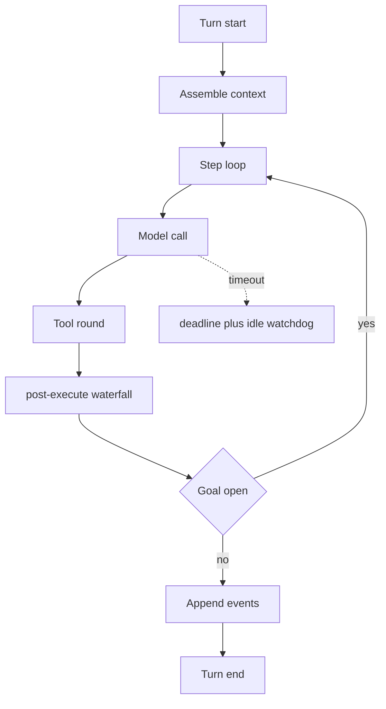
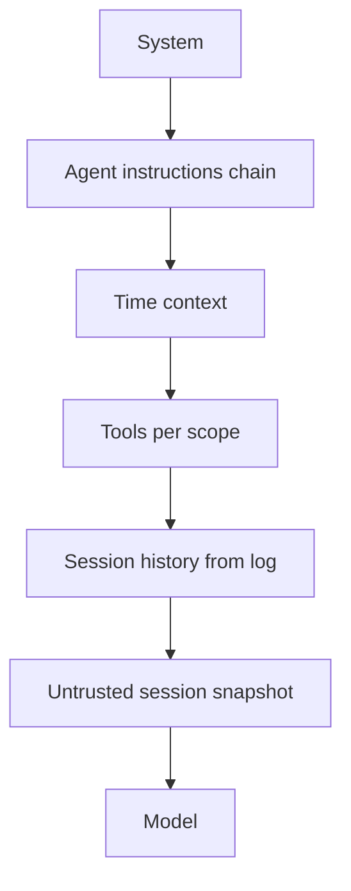
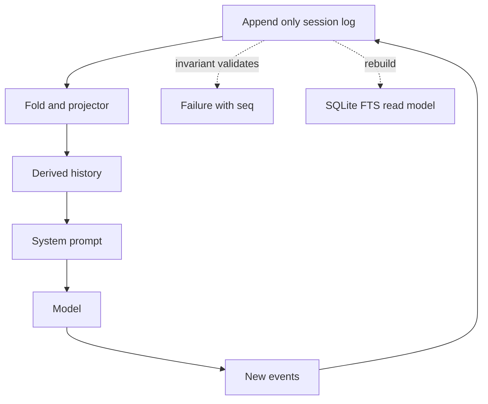

# DeepSeek Harness (dsh) — Architecture Report

**Source:** `/opt/data/dsh-repo`, commit `c389f96bf3a9b6807cb71ed6bdad5849be0df6d8` (2026-09-08), upstream `deepseek-ai/deepseek-harness`.
**Method:** source-code read. Every claim carries `path/file.ts:line`. What could not be verified is marked *not measured*.
**Note:** `/srv/deepseek-harness` is an old copy without `.git` and was **not** used.

---

## 1. Agent Loop

dsh has no monolithic loop module. The turn is a composition of small Cordis plugins, each owning one
concern and exposing it through a service seam. The loop is assembled by injection, not by a central
`while`.

Three loops are nested:

1. **Step loop** — one model call plus the tool round it triggers.
2. **Round loop** — `goal-round-driver` re-arms the step loop while a goal is open
   (`packages/goal/goal-round-driver/src/index.ts:361`).
3. **Turn loop** — the session turn; the outer boundary is the user message or a steering event.

**Step loop.** In `native` mode each step hands the model every tool visible to the agent scope. There
is no built-in turn-budget mechanism in the default agent loop — no `max_steps`, no wall-clock cap. This
is a genuine difference from Hermes (`max_iterations`) and from AKR (`turn/budget.rs`, two clamps).

**LLM call.** Retry and cancellation live in the model stream handling. Cancellation is cooperative:
an abort signal propagates into the iterator, and `dsh-timeout` supplies both a hard `deadline` and an
`idleWatchdog`. The watchdog timer is armed **only while an iterator `next()` is open** and is re-armed
by SSE comment pulses — that design exists specifically so a streaming model that is alive but silent
does not hang the turn, while a model that is producing keepalives is not killed.

**Tool scheduling.** Tools are dispatched through the registry with a `tools/post-execute` waterfall.
Results flow back as `post-execute` transformations, which is what makes the spill policy a plugin
rather than core logic.

**Abort.** `CancelledError` surfaces at the step boundary; the durable log records the abort so a
resume does not replay the cancelled step.

---

## 2. Prompt Assembly

Assembly is itself a plugin set, not a function:

- `packages/context/agent-instructions/src/files.ts` — the AGENTS.md chain. Loaded per project
  directory, **byte-budgeted**, with a refresh when the file changes on disk
  (`files.ts:152`, `files.ts:333`, state in `state.ts:265`).
- `packages/context/agent-instructions` injects the chain as untrusted project instructions.
- `time-context` injects the current time.
- `session-reference` resolves an `@session` mention into a **snapshot marked untrusted** — the
  referenced session's content is data, not instruction. This is a deliberate prompt-injection
  boundary.

Ordering is plugin registration order, so the effective prompt depends on which context plugins are
mounted. That is a real property of the design, not an accident: the composition *is* the assembly.

**Caching boundaries:** not measured in this pass.

---

## 3. Memory

**dsh has no standalone memory system.** This is the headline finding of the memory area. The role
usually called "memory" is distributed across four mechanisms:

| Kind | Mechanism | Loaded |
|---|---|---|
| (a) always-injected prompt part | `agent-instructions` (AGENTS.md chain), `time-context` | every step |
| (b) retrieval | `session-query` / `session-query-sqlite` (FTS5) + 5 read-only tools | on demand |
| (c) session/event history | append-only session log | every step |
| (d) procedural (skills) | on-demand skill loading | on demand |

**Lifecycle.** No LLM decision writes memory; the model can only *query*. Everything durable is written
by deterministic services appending to the session log. There is no mechanism equivalent to Hermes'
`learn_prompt.py` that turns an experience into a persistent skill.

**Retrieval** is authorised against the calling session — the 5 read-only tools
(`session_search`, `event_search`, `trace`, `event_read`, `event_trace`) can only read what the
caller may see. SQLite/FTS5 is a **disposable read model** over live and persisted sessions, not the
authoritative history.

---

## 4. Context Management

**Spill policy** (`packages/spill/spill-policy/src/index.ts:1-30`) is a `tools/post-execute` result
transformer. When a plain-text result exceeds `maxInlineBytes` (UTF-8 bytes), the full text goes to a
session-scoped spill artifact and the model-facing result is replaced by a head/tail preview plus the
locator and retrieval guidance.

Design points worth copying:

- **The policy registers no service and owns no storage.** Preview is `@deepseek-ai/dsh-output-retention`
  (`TextRetainer`), storage is `ctx.spillStore`. The policy decides *when* to spill, nothing else.
- Omitting `maxInlineBytes` registers nothing — a true no-op (`index.ts:20` region).
- Only plain-text results; a result carrying any non-text block is left untouched.
- `read` is excluded from the model-facing arm to avoid a `read → spill → read again` loop
  (`index.ts:67` region). The dispatch-log arm *does* bound `read`.
- A second arm applies the same cap to the **durable log**: the `tools/ptc-dispatch-log` waterfall
  bounds the `tool/code-dispatch` event's copy of an oversized `run_code` sub-call result. The
  program's value is untouched; UIs and replay read the full text through the artifact.

`spill-local` (`packages/spill/spill-local/src/index.ts:1-30`) persists to a private session-scoped
file with traversal-safe segment encoding and exclusive owner-only write. Root defaults to a lazily
created `0700` per-process directory under the OS temp dir. `cleanupPeriodDays` defaults to 30, applied
by one best-effort startup sweep. Retrieval hint (`:159`):
`Use read with offset/limit, or grep this path to search within it.`

> **Correction to an earlier working note:** the base spill threshold is **50 000 UTF-8 bytes**, not
> 8 KiB. The separate tool-result pruner threshold is **8192 characters**. The earlier figure
> conflated the two.

**Compaction** (`packages/compaction/compaction-basic/src/index.ts:148`, `:180`). Not measured in
detail in this pass.

**What survives, what may be lost, what is sacrificed first — not measured.** dsh answers the tool-output
problem structurally (spill to an addressable artifact) instead of by summarising, which is why the
question has a different shape here than in Hermes.

---

## 5. Tools

Registry-based; plugins contribute tools; discovery is registration-time. In `native` mode each step
receives **every tool visible to the agent scope** — reduction happens by scope and deployment, not by
the current conversation. In `ptc` mode the tool set reduces to `run_code`.

So the answer to "all tools every turn or dynamic reduction?" is: **all tools per scope**, with the
exception of the `ptc` execution mode. That is the same shape as Hermes and different from AKR, where
`tool_info.rs` resolves schemas per intent and ACL decides what a caller sees at all.

`tools/post-execute` is the extension point that makes spill, pruner and retention plugins possible
without touching dispatch.

---

## 6. Agent State — the append-only session log

dsh describes the session as an append-only event log and as the single source of truth. The flow:

```
session event log (append-only, authoritative)
  -> fold / projector (derived, disposable)
  -> derived history
  -> system prompt
  -> model
  -> tool calls
  -> new events appended
```

**The boundary between event and derived state is explicit and enforced.** Goal invariants
(`packages/goal/goal/src/invariant.ts:1-40`) install an *independent incremental fold* over every
attached session: `cloneState` copies the fold, `applyChecked` runs one candidate event through the
strict decoder, and a throw is attributed as `session event ${seq} violates the durable goal stream`.
The invariant therefore validates the log, not the fold — a corrupt event fails loudly with its
sequence number instead of silently producing a wrong state.

**FTS5/SQLite is explicitly not authoritative** — it is a read model that may be rebuilt.

---

## 7. Subagents

Not measured in this pass. The agent scope is per-agent (each agent has its own tool scope and its own
repeat-reminder chain, `repeat-tool-reminder/src/index.ts:175`), which is the observable part of the
isolation model.

---

## 8. Learning / Self-Improvement

dsh has no learning loop in the Hermes sense. What it has is **durable, logged state**:

- **Goal service** — one persistent objective per session. `packages/goal/goal/src/invariant.ts`
  folds goal events into `{goal, roundsStarted, createdAt, updatedAt, lastRef, seenGoalIds}`.
  Mutating it is compare-and-set against the event log. Round cap 256.
- **Goal round driver** (`packages/goal/goal-round-driver/src/index.ts:361`) — auto-continues the
  turn when the goal is open but the model went idle. Authority sits at the execution point.
- **Plan mode** — state in the log, while the plan tool stays permanently in the schema; release via
  `user-questions`.
- **`user-questions` / `user-approval`** — a tool call pauses for a human decision.
- **`repeat-tool-reminder`** (`packages/guard/repeat-tool-reminder/src/index.ts:29-49`) — advisory
  nudge at consecutive-repeat counts `[3, 5, 8]` (configurable), payload preview 500 chars, tools
  matching a transparent pattern neither count nor reset (`:33`, `:175`). A user interjection deletes
  the chain: *"A user interjection changes the context; repetition across it is not a loop. Pure reset
  hook"* (`:226-230`). It enriches post-execute decisions with logged model context **without vetoing
  or rewriting calls** (`:2-3`).

All of this is persistent state and prompt/state modification. None of it is model-weight learning.

---

## 9. Persistence / Resume

Append-only session log is the durable record; SQLite/FTS5 is a rebuildable read model. Resume replays
the log. Concurrent sessions are isolated per session. Crash repair and compaction lineage: not measured.

---

## 10. Failure Modes

- **No default turn budget.** A runaway turn is bounded only by external means. This is the most
  consequential difference from Hermes and AKR.
- The spill policy is a genuine no-op unless `maxInlineBytes` is configured — a silent misconfiguration
  means unbounded tool results.
- Spill files are local filesystem; the retention sweep runs once at startup, so a long-lived process
  accumulates.
- Invariants validate events but the *derived* fold can still be rebuilt from a valid log, so recovery
  is safe but recomputation cost is real.

Documented bugs from notes: not mined in this pass.

---

## 11. Doctrine — the Capability Seam

The transferable core of dsh is not a pattern but a rule set:

- **Capability seam = service definition + provider + consumer.** Every capability needs all three.
- **Model-visible counts only if it is reconstructable from the log.**
- **No public service method with only an internal caller.**
- **Enforcement sits where the decision is made.**
- **Bounds apply to the complete result including wrappers.**

Where it shows up concretely: the spill policy registers no service and owns no storage, because those
seams already exist. The goal invariant validates events rather than trusting a caller, because
enforcement sits at the log.

---

## Diagrams

### Agent loop



### Prompt assembly



### Event log and derived state



---

## Open questions

- Tool registry resolution, per-step exposure and the full visibility resolver: not measured.
- Compaction internals (`compaction-basic`): not measured.
- Subagent state/context flow: not measured.
- Crash repair, partial tool calls, concurrent sessions: not measured.
- Prompt caching boundaries: not measured.
- Bug notes under `.agents/notes/{bug-fix,process}`: not mined.

---

## Findings for AKR

Checked against AKR source before writing; three items that look like gaps turned out not to be.

1. **Adopt the spill policy's "decide only when" rule.** `spill-policy` registers no service and owns no
   storage, so storage and preview stay replaceable. AKR's `spill.rs` is one module with the skip-list
   inline; separating the *decision* (`maxInlineBytes` → spill or not) from the *mechanics* would make
   the backend replaceable without touching the policy.
2. **Adapt the double threshold.** dsh caps the model-facing result at 50 000 bytes and the durable log
   copy at 8 192 chars. AKR has a single budget (`DEFAULT_BUDGET: usize = 2400`, `spill.rs:19`). Two
   caps with different purposes — context relief versus log size — are a defensible split; one cap
   forces a compromise.
3. **Do not adopt the user-interjection reset.** AKR's `last_tool_signature` /
   `consecutive_same_signature` are function-local per turn (`handle_chat.rs:691-692`), so the counter
   resets at every turn boundary — strictly stronger than dsh's "delete the chain on a user
   interjection" (`repeat-tool-reminder/src/index.ts:226-230`). Nothing to adapt here.
4. **Reject the "advisory only" posture.** dsh's reminder never vetoes or rewrites a call
   (`repeat-tool-reminder/src/index.ts:2-3`). For AKR that is right at 3 and 5 and wrong at 8 — the hard
   abort is the kernel's job, and AKR already does it.
5. **No action — spill fallback already correct.** AKR's `spill()` returns `None` on failure and the
   docstring states that the caller truncates locally (`spill.rs:71-73`), so the original text is
   preserved. Same guarantee as dsh. Recorded here because it looked like a gap and is not.
6. **Do not adopt "no turn budget".** dsh's default loop has no step or wall-clock cap. AKR's two clamps
   (`budget.rs:264`) plus the LLM idle deadline are strictly better and should stay.
7. **Consider the event-bound invariant.** dsh validates the log with an independent fold and reports
   the failing `seq`. AKR's kernel event log is thin (`src/event_log/` 281 lines) while session history
   lives in the session plugin — the same invariant style applied there would make the derived history
   verifiable.
8. **Keep AKR's goal CAS.** `goal_round_driver.rs` already does `advance(conv, id, revision)` with a
   `goal_rev != r.revision` check (`:157-158`) — structurally the same compare-and-set as dsh's goal
   stream. No change needed.

---

## Kurzfassung für Dennis

dsh ist kein monolithischer Loop, sondern eine Komposition von kleinen Cordis-Plugins — die
Zusammensetzung *ist* die Prompt-Assembly, die Reihenfolge folgt der Registrierung. Zwei Befunde
tragen: dsh hat **kein** eingebautes Turn-Budget im Default-Agent-Loop, das ist der gravierendste
Unterschied zu Hermes und AKR. Und die Spill-Policy ist so gebaut, dass sie **keinen Service
registriert und keinen Storage besitzt** — sie entscheidet nur, *wann* gespillt wird, während Preview
und Datei woanders liegen. Genau diese Trennung fehlt AKR noch, dort ist Spill ein Modul mit allem
drin. Die Basis-Grenze liegt bei 50.000 UTF-8-Bytes, nicht 8 KiB — die alte Notiz war falsch, der
8192-Wert gilt für den separaten Tool-Result-Pruner. Doom-Loop-Erkennung, Spill-Skip-Liste und
Goal-CAS hat AKR bereits, das steht als widerlegte Annahme in der Baseline. Übernehmen lohnt sich die
Doppelgrenze, die Reset-Semantik bei User-Interjektion und die Invariant-Technik: dsh validiert den
Event-Log mit einem unabhängigen Fold und meldet die fehlerhafte `seq`, AKR hat das für den
Session-Verlauf nicht.
