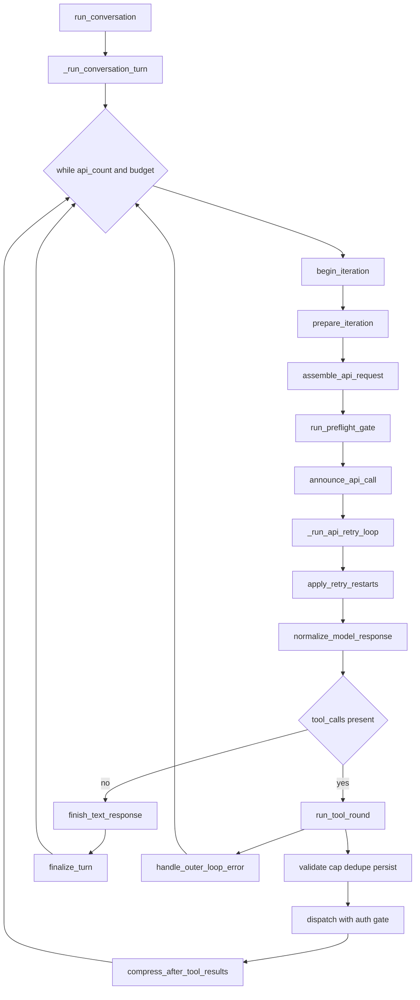
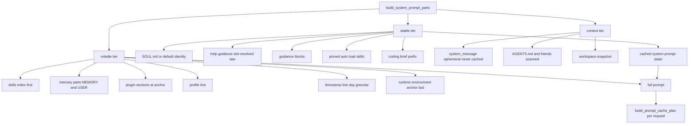
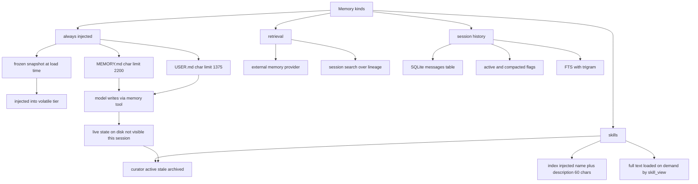

# Hermes Agent Framework — Architekturbericht (Ist-Stand)

**Quelle:** `/srv/hermes/workspace/tmp/agent-research/hermes`, Commit `6ec05205a943cf813bd56c3c79d64bcf922dac67` (2026-09-30).
**Methode:** reiner Code-Read. Jede Behauptung mit `file.py:line`. Wo ich nicht messen konnte, steht „nicht gemessen". Keine Änderung am Repo.

Abschnitt 1 stammt 1:1 aus dem ersten Subagent-Durchlauf (`hermes.part-a.md`), der am Zeitlimit starb. Abschnitte 2–13 habe ich selbst gemessen. Drei Korrekturen an den Vorb-Maßen sind unten markiert.

**Maßeinheiten (alle gemessen, nicht geschätzt):**

| Größe | Wert | Quelle |
|---|---|---|
| `run_agent.py` | 1582 Z | `wc -l` |
| `agent/conversation_loop.py` | 1788 Z | `wc -l` |
| `agent/prompt_builder.py` | 1831 Z | `wc -l` |
| `agent/tool_executor.py` | 1926 Z | `wc -l` |
| `agent/context_compressor.py` | 5673 Z | `wc -l` |
| `agent/conversation_compression.py` | 4579 Z | `wc -l` |
| `agent/auxiliary_client.py` | 8255 Z | `wc -l` |
| `tools/registry.py` | 1043 Z | `wc -l` |
| `agent/turn_*.py` | 12438 Z in 31 Dateien | `ls agent/turn_*.py \| xargs wc -l` (**Korrektur:** 31, nicht 30) |
| `hermes_state*.py` | 31 Module | `ls hermes_state*.py \| wc -l` (**Korrektur:** 31, nicht 30) |
| `agent/` Module | 259 Dateien | `ls agent/ \| wc -l` |
| Skills | 14 Kategorien, 24 optional | `ls skills/ \| wc -l`, `ls optional-skills \| wc -l` |
| Evals | 69 Einträge (inkl. Verzeichnisse + `__init__.py`) | `ls evals/ \| wc -l` |
| Issue-Referenzen im Code (`#12345`) | 2750 | `grep -rhoE '#[0-9]{4,6}'` |
| `except Exception: … pass` in agent/ + tools/ | 156 | `grep -c`, erster Durchlauf |
| `CREATE TABLE` in `hermes_state_common.py` | **13** | grep, s. §9 (**Korrektur:** 13, nicht 12) |
| `docs/` | existiert nicht | `ls docs` → No such file or directory |

---

## 1. Agent Loop

*(1:1 aus `hermes.part-a.md`, unverändert.)*

**Einstiegspunkt.** `run_conversation()` in `agent/conversation_loop.py:1695` ist der einzige öffentliche Export der Datei (`__all__ = ["run_conversation"]`, `agent/conversation_loop.py:1788`). Es ist ein dünner Wrapper: öffnet einen Scope für native Turn-Images (`agent/conversation_loop.py:1723`), delegiert an `_run_conversation_turn()` (`:1724`), exportiert danach die Turn-Grenze (`export_current_turn_boundary`, `:1740`) und schließt fehlgeschlagene Turns (`_close_durable_failed_turn`, `:1741`).

Die eigentliche Iterationsmaschine sitzt in `_run_conversation_turn()` (`agent/conversation_loop.py:1533`). Der Kontrollfluss ist **kein** `while → model → tool → model`, sondern eine **Phase-Pipeline mit uniformer Verdict-Schnittstelle**. Der Zustand liegt in einem einzigen `dataclass _LoopState` (`agent/conversation_loop.py:1385`), das ca. 45 Felder hält; die Phasen sind Funktionen in `agent/turn_*.py`, die per Keyword-Argument die benannten Felder bekommen und ein `Verdict`-Objekt mit gleichnamigen Feldern zurückgeben. Der Mechanismus ist `_run_phase()` (`agent/conversation_loop.py:1480`): es cached die Signatur-Parameter pro Funktion (`_PHASE_PARAMS`, `:1474`), übergibt `extra` für Nicht-State-Argumente (die Exception), und kopiert alle Verdict-Felder **per `setattr` zurück** — mit einer Ausnahme: `_LATCHED_VERDICT_FIELDS` (`:1477`) erlaubt für `handle_api_error`, `_provider_overflow_recovery_pending` nur `True` zu werden, nie zurückgesetzt zu werden. Das ist ein bemerkenswertes Detail: der Loop schützt eine Overflow-Wiederherstellungs-Armierung explizit davor, dass ein einzelner Retry sie zurücksetzt.

Die äußere Schleife (`:1636`):

```
while (s.api_call_count < agent.max_iterations and agent.iteration_budget.remaining > 0) or agent._budget_grace_call:
```

Drei Abbruchbedingungen gleichzeitig: Iterationszähler, Budget-Objekt, plus ein „grace call"-Flag, das eine letzte Iteration erlaubt. Innen der Schleife laufen **13 Phasen** in fester Reihenfolge:

1. `begin_iteration` (`:1637`) — bricht bei Turn-Ende
2. `prepare_iteration` (`:1639`)
3. `assemble_api_request` (`:1640`)
4. `run_preflight_gate` (`:1641`) — kann `return`, `break` oder `continue`
5. `announce_api_call` (`:1648`)
6. `_run_api_retry_loop` (`:1654`) — der Modellaufruf inkl. Retry
7. `apply_retry_restarts` (`:1658`)
8. `normalize_model_response` (`:1665`)
9. `run_tool_round` **oder** `finish_text_response` (`:1670-1672`) — die Verzweigung nach `assistant_message.tool_calls`
10. `handle_outer_loop_error` (`:1680`) — der einzige `try/except` um die Tool-Runde

Danach `finalize_turn()` (`agent/turn_finalizer.py`, aufgerufen `:1684`) und ein Special-Case: bei `_compression_timeout_exhausted` wird das Ergebnis mit `error`/`partial`/`compression_exhausted` überschrieben (`:1688-1691`), damit das Gateway den Context-Recovery-Vertrag sieht.

**Der Modellaufruf** ist in `_run_api_retry_loop()` (`:1501`) gekapselt: eine `while retry_count < max_retries`-Schleife um vier Phasen — `nous_rate_limit_guard`, `build_api_request`, `perform_api_call`, `check_api_response` — plus zwei `except`-Zweige (`InterruptedError` → `handle_api_interrupt`, `Exception` → `handle_api_error`). Jede Phase kann `return` (Turn-Envelope), `break` (Retry-Schleife verlassen) oder `None` (Retry).

**Budget.** `IterationBudget` (`agent/iteration_budget.py:25`) ist ein thread-sicherer Zähler mit `consume()`/`refund()` und `_lock`. Wichtig für AKR: das Budget ist **pro Agent-Instanz**, nicht pro Turn. Der Docstring (`:3-6`) sagt explizit: „the parent's cap is `max_iterations` (default 500), each subagent's `delegation.max_iterations` (default 50), so total iterations across parent + subagents can exceed the parent's cap." Subagenten bekommen `iteration_budget=None` übergeben (`tools/delegate_tool.py:246`) und erzeugen ein **frisches** Budget — keine hierarchische Budget-Teilung. Das ist eine bewusste Abweichung von einem deterministischen Kernel mit hierarchischen Quoten.

Default `max_iterations` im `AIAgent.__init__` ist `sys.maxsize` (`run_agent.py:268`) — „unlimited tool-calling iterations by default". Der reale Deckel kommt also aus `agent_init` (`agent/agent_init.py:2422`: `IterationBudget(max_iterations)`) bzw. aus dem Gateway. Für Delegation: `DEFAULT_MAX_ITERATIONS = 250` (`tools/delegate_tool.py:71`), und ein vom Modell übergebener `max_iterations` wird **explizit verworfen** (`:487-492`, „the config value is authoritative").

**`_api_max_retries` und Backoff.** `s.max_retries = agent._api_max_retries` (`:1650`), pro Iteration auf 0 zurückgesetzt. Der Backoff ist in `compute_error_backoff()` (`agent/turn_recovery.py:1384`) implementiert und **kein blinder Sleep**: `Retry-After` gewinnt bei jedem retryable Fehler (nicht nur 429), aus Header **oder** aus dem Body — inklusive verschachteltem `error.retry_after` (`:1404-1411`), gedeckelt bei 600 s (`:1413`). Nicht-429 nutzt `jittered_backoff`, 429/Z.AI-Overload eine `adaptive_rate_limit_backoff`-Policy. **Retry-ohne-Backoff habe ich nicht gefunden.**

**Cancellation.** `agent._interrupt_requested` ist das Flag (`run_agent.py:1121-1123`), der Scope lebt in `agent/interrupt_scope.py:27` (`class InterruptScope`). Cancellation ist **kooperativ, nicht präemptiv**: `_dispatch_authorized_once` (`:681`) und `_poll_sequential_future` (`:862`) pollen, `_interrupt_worker_tids` (`:573`) versucht `Thread`-Interrupt. Bei `InterruptedError` im API-Pfad greift `handle_api_interrupt`. Der Turn kann also mitten in einem Tool-Call abbrechen; das Ergebnis ist ein `error`/`partial`-Envelope.

**Parallelisierung** gibt es auf drei Ebenen:
- **Tool-Batch:** `_max_workers_for_tool_batch()` (`agent/tool_executor.py:239`) — `min(len(runnable_calls), _MAX_TOOL_WORKERS)`, zusätzlich gedeckelt auf `_image_generate_parallel_limit()` (`:244`). Ausführung über `DaemonThreadPoolExecutor` (`:1477-1478`). Ein einzelner Batch-Abbruch wirft `_BatchAbandoned(BaseException)` (`:164`) — bewusst `BaseException`, damit ein `except Exception` in Tool-Code den Abbruch nicht schluckt.
- **Authorization-Gate:** `_ConcurrentToolAuthorizationGate` (`:481`) serialisiert nur den Freigabeteil mit `lock_timeout`, damit parallele Tools keine gleichzeitig laufenden Approval-Prompts erzeugen. Das ist ein **Capability-Gate im Thread-Modell** — für AKR interessant, weil es beweist, dass der Kontrollpunkt nicht der Dispatch selbst ist, sondern der Autorisierungszeitpunkt.
- **Subagenten:** `max_concurrent_children` Default 10 (`tools/delegate_tool_config.py:17`), Env-Var-Override, Warnung bei Werten > 10 (`:103-105`).

**Persist-before-execute.** Der Docstring von `run_tool_round` (`agent/turn_tool_round.py:55-59`) nennt es eine „durability invariant": der Tool-Call-Turn wird **vor** jeder Side-Effect in die DB geschrieben, damit Resume den ausgeführten Block sieht, wenn ein destruktives Tool Hermes neu startet; ein fehlgeschlagener kanonischer Append **beendet den Turn**, statt Tools aus Prozess-only-State zu fahren. Das ist die eine Stelle, an der Hermes nahe an Event-Sourcing geht — aber ohne Event-Log, sondern über das kanonische `messages`-Array.

**Tool-Runde im Detail** (`agent/turn_tool_round.py:57ff`): `validate_tool_calls` → `_deduplicate_tool_calls(_cap_delegate_task_calls(...))` (`:88-91`) → Mixed-Batch-Splitting (ungültige Calls bekommen eine Fehler-Result-Zeile, `:99-110`) → `stage_tool_call_message` + `append_message` → Dispatch → Guardrail-Halt / Persistenz-Fehler → **Kompression nach den Tool-Ergebnissen** (`compress_after_tool_results`, Import `:18`).

`_cap_delegate_task_calls` (`run_agent.py:1201`) und `_deduplicate_tool_calls` (`:1221`) sind Anti-Doom-Maßnahmen auf Modellebene: identische Tool-Calls eines Turns werden zusammengefasst.

**Doom-Loop-Erkennung** gibt es auf drei, nicht auf einer Ebene:
- **Textseitig:** `agent/repetition_guard.py` — `is_repetition_dominated` (`:49`), `is_runaway_repetition` (`:137`). Bemerkenswert: der Kommentar (`:44`) nennt die konkrete Fehlskala „real stop-path loops (#100716) run 80k-350k chars" — die Schwelle wurde also gegen echte Produktionsdaten kalibriert, nicht geraten.
- **Toolseitig:** Dedup + `delegate_task`-Cap pro Round.
- **Denkseitig:** `_is_thinking_only_assistant` (`run_agent.py:1142`) — Assistant-Turns, die nur aus `thinking` bestehen, werden erkannt und (je nach Protokoll) verworfen, weil Anthrop-Backends auf einem trailing `thinking`-Block mit 400 antworten.
- **Kontextseitig:** Anti-Thrash-Breaker in `should_compress_info` (`agent/context_compressor.py:2886`), `_tripped()` (`:2907`) bei zwei wirkungslosen Kompressionen oder zwei Fallback-Summaries in Folge.

**Recovery auf Loop-Ebene.** `_outer_error_count` mit `_MAX_OUTER_LOOP_ERRORS = 8` (`agent/conversation_loop.py:235`), als Cap `min(_MAX_OUTER_LOOP_ERRORS, max(1, agent.max_iterations))` (`agent/turn_loop_errors.py:149`). Neben dem API-Retry existiert ein eigener `restart_count`-Zähler **pro Turn**, der sich bewusst vom `retry_count` unterscheidet, das pro Iteration auf 0 zurückgesetzt wird (Kommentar `agent/conversation_loop.py:1420-1424`): „a runaway interrupt/redirect that keeps re-arming a restart flag cannot refund the iteration budget forever and hold the turn lease indefinitely." Das ist eine sehr spezifische Lehre aus einem Produktionsbug.

**Codex-Ausweichpfad.** `agent.api_mode == "codex_app_server"` (`:1622`) gibt den **gesamten Turn** an einen Subprocess, bevor der generische Loop erreicht wird. Schlägt das fehl, wird der Failover aktiviert und derselbe User-Turn im generischen Loop neu gefahren, wobei die projizierten Zeilen und der fehlgeschlagene API-Call in der Abrechnung bleiben (`:1628-1634`).

**Session-Grenzen.** Der Loop selbst kennt keine Session-Grenze. Die Grenze wird von außen gesetzt: `reset_session_state()` (`run_agent.py:413`), `_ensure_db_session()` (`:349`) und der Gateway. Das ist ein bewusster Schnitt: Turn = eine `run_conversation`-Invokation, Session = DB-Row-Lebenszyklus.

---

## 2. Prompt Assembly

Der System-Prompt wird in **drei geordneten Cache-Tiers** gebaut, nicht in einem flachen String. `build_system_prompt_parts()` (`agent/system_prompt.py:734`) gibt `{"stable", "context", "volatile"}` zurück (`:797`), und `build_system_prompt()` (`:801`) jointet sie und legt `parts["stable"]` in `agent._cached_system_prompt_static` ab (`:805`) — dieser Wert ist der Anker, den die Cache-Planung später benutzt (siehe §4).

Der Docstring (`:735-742`) ist die eigentliche Spezifikation: *stable* = Identität, Guidance, Coding-Brief; *context* = `system_message` des Aufrufers, Projekt-Context-Files, Workspace-Snapshot, restliche Workspace-Guidance; *volatile* = Skills-Index, Memory, User-Profil, externer Memory-Block, Zeitstempel, Runtime-Umgebung. Schlusssatz: „Never re-rendered mid-session."

### Stable Tier

Reihenfolge aus `agent/system_prompt.py:746-766`:

1. `_identity_parts(agent, ctx_len)` (`:545`) — **SOUL.md** aus dem eigenen `HERMES_HOME`, sonst `DEFAULT_AGENT_IDENTITY`. Cron behält die Persona, überspringt cwd-Instruktionen. Liefert `(parts, soul_loaded)`.
2. Ein Platzhalter-Slot `_help_guidance_slot` (`:748`) für die Help-Guidance, **der erst am Ende ersetzt wird** (`:755-757`): die Variante mit `skill_view`-Pointer wird nur gewählt, wenn `"skill_view" in agent.valid_tool_names` **und** `"- hermes-agent:"` im gerenderten Skills-Index steht. Beide Bedingungen sind Strings — der Kommentar nennt das „a pure string check — inherits the index's stability". Grund: der `skill_view()`-Zeiger „dangles" ohne Skill-Tools.
3. `_guidance_parts(agent)` (`:559`) — universelle, tool-bewusste und modell-gegatete Blöcke, jeder an einem eigenen `config.yaml`-Key.
4. `_alibaba_identity_part(agent)` (`:758`)
5. `_auto_load_parts(agent)` (`:760`) — **gepinnte Skills**, pro Agent-Instanz einmal aufgelöst, deshalb im Stable-Prefix
6. `_coding_parts(agent)` (`:764`) — aufgeteilt in `coding_prefix_parts` (bleibt stable), `coding_workspace_parts` und `coding_trailing_parts`

Die Begründung für die Aufteilung ist eine Cache-Budget-Überlegung, kein Geschmack: der Environment-Block (aktuelles cwd/Backend) gehört **hinter** den Projektkontext, „not ahead of a large shared AGENTS.md block" (`:762-763`), weil er sonst den gemeinsamen Präfix über Worktrees hinweg zerstören würde.

### Context Tier

`agent/system_prompt.py:769-775`: zuerst `system_message`, wenn gesetzt — mit dem Kommentar „ephemeral_system_prompt is injected at API-call time only, never cached" (`:768`). Dann `_context_files_part(agent, _ctx_len, _soul_loaded)` (`:714`). Dann der Workspace-Snapshot-Block samt Trailing- und Post-Workspace-Teilen — **außer** es gibt keinen Worktree-Snapshot, dann wandern die Trailing-Teile zurück in den Stable-Tier (`:774-776`), „Preserve the stable placement for non-workspace sessions".

Caps skalieren mit dem Modellkontextfenster: `_ctx_len` kommt aus `agent.context_compressor.context_length` (`:744-746`), und `_get_context_file_max_chars()` / `_dynamic_context_file_max_chars()` (`agent/prompt_builder.py:1155`, `:1147`) leiten daraus die Grenzen ab.

### Volatile Tier

`agent/system_prompt.py:778-796`. Reihenfolge ist begründet, nicht zufällig:

- **Skills-Index zuerst** (`:783`) — „Skills are runtime-mutable, so the index leads the volatile band: on a longest-prefix backend an unchanged index stays inside the reused prefix; a changed one re-prefills from here."
- Dann `_memory_parts(agent)` (`:516`)
- Plugin-Sektionen an **einem** groben Anker (`"after_memory"`, `:785`): „so a resumed process can reconstruct the stable prefix without re-running plugins"
- `_active_profile_line(agent)` (`:788`) — „The profile line names this home's path, so it rides in the volatile tier: the stable prefix then stays byte-identical across every profile (and home) on the host."
- `_timestamp_line(agent)` (`:789`) — taggranular: `if now.strftime("%Y%m%d") != _start.strftime("%Y%m%d")` (`:506`) wird nur ein Zusatz angehängt. Der Kommentar (`:504`): „the single-line shape stays byte-identical for the day (prefix-cache safe)."
- Ganz am Ende der Runtime-Environment-Block (`:793-796`), mit einem `> `-Escape für das Heading (`:794`), „Keep the renderer-owned runtime anchor after all user/plugin prose so quoted host examples cannot shadow it during persisted-prompt validation."

### Was in den Prompt kommt — und was nicht

`_memory_parts()` (`agent/system_prompt.py:516`) ist der einzige Ort, der entscheidet, ob Memory überhaupt im Prompt landet:

```python
if agent._memory_store:
    for enabled, kind in ((agent._memory_enabled, "memory"), (agent._user_profile_enabled, "user")):
        block = agent._memory_store.format_for_system_prompt(kind) if enabled else None
```

Der externe Memory-Provider-Block ist **additiv** und an dieselbe Bedingung gekoppelt wie `inject_memory_provider_tools` — „so we never advertise provider tools that the agent's toolset configuration has already gated off (#81014)" (`:528-529`). Beide Blöcke sind in `try/except Exception` gehüllt (`:530-533`): ein kaputter Provider darf den Prompt nicht killen, kostet aber stillschweigend den Memory-Block.

`build_memory_guidance()` (`agent/prompt_builder.py:193`) ist der Ort, an dem die **Routingsregel selbst** im Prompt steht — und zwar als Abgrenzung Memory vs. Skill:

> „You have persistent memory, carried across sessions and loaded into each new session's context; the memory tool's schema defines what belongs there."
> „Skills come first: when you learn something while doing a task — a procedure, a pitfall, and the user's preferences and corrections for that kind of work — record it in the skill you used or built for the task (skill_manage), where it loads only when relevant." (`:210-215`)

Das ist die einzige Stelle im ganzen Framework, an der die Memory-Taxonomie dem Modell erklärt wird. Sie ist Prosa, nicht Typsystem.

### Injection-Sicherheit bei Context-Files

`_scan_context_content()` (`agent/prompt_builder.py:83`) unterscheidet zwei Trust-Klassen:

- **Repo-Kontext** (`AGENTS.md`, `.cursorrules`, `.hermes.md`): ein Treffer für Prompt-Injection **blockiert** die Datei (`:84`, `:94`)
- **`SOUL.md` im eigenen `HERMES_HOME`**: Treffer wird **gewarnt**, die Datei lädt trotzdem (`:89-90`), weil SOUL.md dieselbe Trust-Klasse wie `config.yaml` hat — File-Tool-Writes darauf gehen durch denselben Weg (`:90-91`). Ausnahme: ein von `hermes profile install` kopiertes SOUL.md wird **unscannt** eingefügt und hat damit dieselbe Klasse wie der gemessene Falsch-Profil-Bug #50233 (`:95`, `:1609`)

`load_soul_md()` (`:1602`) nutzt einen ContextVar mit Fallback auf die Launch-Home, weil sonst „the wrong profile's SOUL.md" gelesen wird (`:1609`).

### Skills-Index-Caching

`_skills_prompt_snapshot_path` (`:1188`), `clear_skills_system_prompt_cache` (`:1192`), `_build_skills_manifest` (`:1203`), `_load_skills_snapshot` (`:1234`). Der Index wird aus einem Snapshot auf der Platte gebaut, damit er nicht bei jedem Turn das Skills-Verzeichnis scannt.

---

## 3. Memory

Hermes hat **vier** unterscheidbare Gedächtnisse. Sie teilen sich nicht den Lebenszyklus, nicht den Speicherort und nicht die Laderegel.

### (a) Immer injiziert: `MEMORY.md` / `USER.md`

`class MemoryStore` (`tools/memory_tool_store.py:88`) — „Bounded curated memory with file persistence; one instance per AIAgent." Docstring (`:89-91`):

> `_system_prompt_snapshot` is frozen at load time (prefix-cache stable); `memory_entries` / `user_entries` are live state persisted to disk.

Das ist der entscheidende Designzug, und er ist eine direkte Folge der Cache-Doktrin:

- **Datei:** `memory_dir / ("USER.md" if target == "user" else "MEMORY.md")` (`:212`)
- **Budgets in Zeichen, nicht Tokens** — Header (`:2`): „budgets are in chars (model-independent)". Defaults: `memory_char_limit=2200`, `user_char_limit=1375` (`:99`). Trennzeichen `ENTRY_DELIMITER = "\n§\n"` (`:23`)
- **Prompt-Block:** `_render_block` (`:483`) rendert Header + Auslastungsanzeige + Einträge, z. B. `MEMORY [43%]` zwischen zwei `═`-Linien (`:487-489`)
- **Der Prompt bekommt den Stand von Session-Start, nicht den Live-Stand:** `format_for_system_prompt()` (`:463`) gibt den eingefrorenen `_system_prompt_snapshot` zurück, ausdrücklich „NOT live state — mid-session writes don't touch it, preserving the prefix cache" (`:464-465`). Ein Memory-Write mitten in der Session ist also **in dieser Session unsichtbar**.

**Das ist eine bewusste, unbequeme Konsequenz.** Sie ist nirgends als Trade-off dokumentiert, nur als Caching-Regel. Für AKR ist das der wichtigste Einzelbefund aus diesem Abschnitt: „Memory-Injektion" und „Memory ist immer aktuell" sind hier unvereinbar.

Lifecycle der Einträge:
- `add` (`:276`) lehnt ab, wenn `len(ENTRY_DELIMITER.join(entries + [content])) > limit` (`:287`)
- `replace` (`:298`), `remove` (`:312`) — beide über `_locate` (`:318`), das Mehrdeutigkeit explizit behandelt (`_find_unique_match` `:58`, `_stale_entry_message` `:77`)
- Batch-Operationen `apply_batch` (`:397`) / `_apply_batch_op` (`:364`) prüfen das Budget **gegen den finalen Zustand** (`:443`)
- **Drift-Erkennung** `_detect_external_drift` (`:530`): wenn die Datei von außen editiert wurde, bricht der Schreibpfad mit `_drift_error` (`:36`) ab statt zu überschreiben. Das ist eine Datenverlust-Verteidigung.
- **Striktes Decoding** (`:492-503`): `errors="replace"` ist verboten, weil der Read-Modify-Write-Caller sonst eine verlustbehaftete Ansicht bekäme, die ein späterer Save über die echten Bytes schreibt — „the wipe class documented above". `utf-8-sig` strippt einen Notepad-BOM (#10878 / PR #10888)
- **Atomar + gelockt:** `atomic_write_text` (`:526`) unter `flock` (`:168-196`)
- **Fehlerbudget pro Turn:** `_MAX_CONSOLIDATION_FAILURES_PER_TURN = 3` (`:97`)
- **Antwortform ohne Echo:** `_success_response` (`:468`) gibt bewusst **keine** Eintragsliste zurück — „TERMINAL and WITHOUT the entries list: echoing entries invites the model to 'find more to fix' and re-issue the same ops" (`:469-471). Erfolgreiche Schreibvorgänge resetten das Fehlerbudget (`:476`, #42405). Aber `**extra` zeigt bei einem `replace` den **überschriebenen Volltext** (`:473`) — „silent data loss is the failure this field exists to prevent" (#117952).

Ein turn-basierter Nudge erinnert das Modell an Memory-Writes: `_tick_memory_nudge()` (`agent/turn_context.py:715`) zählt User-Turns, feuert bei `>= _memory_nudge_interval` und nur wenn `"memory" in agent.valid_tool_names` **und** `agent._memory_store` (`:716-717`).

### (b) Retrieval: Memory-Provider + Session-Suche

**Externe Provider** sind additiv. `agent/memory_provider.py` und `agent/memory_manager.py` ergänzen eigene Tools und einen eigenen Prompt-Block; die Tool-Schemata landen in `valid_tool_names` (`agent/memory_manager.py:142-155`). Ein alternativer Backend existiert als Plugin (`plugins/memory/holographic/store.py:89`, eigene `class MemoryStore`) — **nicht gemessen**, ob das der Default ist oder ein optionales Paket.

**Session-Historie** durchsuchbar über `tools/session_search_tool.py`. Die Kernfunktionen sind keine Volltext-Suche, sondern **Lineage-Arbeit**: `_resolve_to_parent` (`:107`), `_resolve_lineage` (`:123`), `_same_lineage` (`:201`), `_excluded_lineage_roots` (`:192`), Zeitfenster-Filter (`_in_time_window` `:170`), und `_is_compaction_summary` (`:103`) — die unterscheidet eine Zusammenfassungs-Zeile von echten Chat-Zeilen, damit Compaction-Artefakte nicht als Inhalt gefunden werden. Der Index ist SQLite-FTS inkl. Trigramm-Variante: sechs Trigger `messages_fts_{insert,delete,update}` und `messages_fts_trigram_{insert,delete,update}` (`hermes_state_common.py`).

### (c) Session-History

Nicht als „Memory" konzipiert, sondern als kanonische Wahrheit in SQLite — Details in §9.

### (d) Skills

`agent/learning_graph.py:1-6` macht die Trennung explizit und ist die aufschlussreichste Stelle dazu:

> „Scoped to what a user actually learns over time: non-base, learned/profile skills (agent-created or used) plus `MEMORY.md` / `USER.md` chunks as first-class nodes. Skill links come from declared `related_skills`; memory→skill links are derived from lexical overlap."

`SkillNode` (`:170`) mit `source` (`"profile"` default), `use_count`, `state`, `pinned`, `related`. Activity-Zeitstempel aus fünf möglichen Keys (`_USAGE_TS_KEYS` `:167`), damit unterschiedliche Skill-Herkünfte vergleichbar bleiben.

Der Unterschied in der **Laderegel** ist der entscheidende: Skills werden **nicht** injiziert — es steht nur der **Index** (Name + Beschreibung, auf 60 Zeichen gekürzt) im Prompt, geladen wird der Volltext erst bei `skill_view`. Der Index ist das einzige volatile Element ganz vorn (§2). Damit ist „immer injiziert" vs. „on demand" kein Zufall, sondern Kostenrechnung: die Beschreibung wird jeden Turn geladen, der Rest nie.

---

## 4. Context Management

### Trigger

`ContextCompressor.__init__` (`agent/context_compressor.py:2691-2693`):

```python
def __init__(self, model: str, threshold_percent: float = 0.50,
             protect_first_n: int = 3, protect_last_n: int = 20,
             summary_target_ratio: float = 0.20, ...)
```

Damit sind die genannten Werte **Code-Defaults**, nicht nur Config-Defaults. `summary_target_ratio` wird auf `[0.10, 0.80]` geklemmt (`:2732`), `threshold_percent` durch `_effective_threshold_percent()` (`:2088`) **raise-only nach oben** angehoben (`:1178`: „Below this window the threshold is floored (raise-only)"). Per-Modell-Overrides über `model_thresholds` mit Longest-Substring-Match (`:1850-1874`, `:2545`).

`should_compress_info()` (`:2886`) ist die einzige Entscheidungsfunktion:

```python
tokens = prompt_tokens if prompt_tokens is not None else self.last_prompt_tokens
if tokens < self.threshold_tokens:  return False, None
if self._automatic_compression_blocked():  return False, self._compression_block_reason() or "blocked"
return True, None
```

`reason` ist nur gesetzt, wenn Kompression **nötig, aber blockiert** ist — `"cooldown:<s>"`, `"structural_backoff:<s>"` oder `"ineffective"` (`:2888`, `:2897-2905`).

### Druckmessung: drei Korrekturebenen

`agent/turn_request_assembly.py:224-241`. Der Kommentar (`:218-219`) sagt die Größenordnung: „One image-stripped estimate feeds both figures; tools counted separately (50+ tools ≈ 20-30K tokens)".

1. `estimate_messages_tokens_rough(api_messages)` mit Flag `charge_stale_thinking` — nur wenn die aktive Route das Thinking auch wirklich replayt (`:231-235`)
2. **Route-Awareness:** `_midturn_request_pressure_tokens()` (`:237`) berücksichtigt, dass native Responses-Compaction den Wire-Payload vor dem Senden pruned — sonst feuert eine 600-s lokale Kompression, die der Haupt-Request nie gebraucht hätte (#96995, verwandt mit den Preflight-Bugs #96644/#96155, `:233-236`)
3. **Usage-Anchor:** `anchored_context_tokens(messages, agent._usage_anchor)` (`:241`) ersetzt die Heuristik **komplett**, wenn echte `prompt_tokens` (inkl. System + Tool-Schemata) frisch sind. Der Fallback ist „a rough fallback only: floor at the provider's last REAL prompt size" (`:246-251`)

`threshold_tokens` wird lazy aufgelöst (`:2110-2116`) und danach mit `_apply_threshold_tokens_cap()` gedeckelt — „Effective trigger = min(ratio threshold, cap)" (`:2713`).

### Was bleibt garantiert erhalten

| Element | Garantie | Beleg |
|---|---|---|
| System-Prompt | immer | `_protect_head_size()` `:4548` — „Head messages to protect: the system prompt (if present) plus the decaying `protect_first_n` extra rows" |
| Erste N User-Turns | **nur bis zur ersten Kompression** | `_effective_protect_first_n()` `:4535-4545`, Docstring: „decayed to 0 once the session has been compressed so early turns don't fossilize" |
| Letzte N Messages | Minimum, mit Deckel | `min_tail_floor = max(3, min(self.protect_last_n, _MAX_TAIL_MESSAGE_FLOOR))` `:4907` — Kommentar: „protect_last_n is a **minimum** up to a cap so bulky tool runs" |
| Verbatim User-Messages im Tail | ja | `min_tail_user_messages: int = 1` `:2698` |
| Screenshots im Tail | nicht demotierbar | `:1171-1172` — „Native vision_analyze / computer_use screenshots that sit inside the protected tail cannot be demoted" |
| Skills-Nutzung | Skill-Namen werden gesammelt | `_collect_protected_skill_names()` `:1129` — kürzlich geladene Skills bzw. im Tail genannte bleiben am Leben |

**Die Head-Garantie ist die interessanteste.** Ein dauerhaft geschützter Head fossilisiert: die ersten drei Turns einer Session werden für deren ganze Lebensdauer nie komprimiert, egal wie alt sie sind. Hermes löst das durch **Decay** — nicht durch Weglassen, sondern durch zeitliche Degradierung.

### Was wird zuerst geopfert

Die Reihenfolge ist eine Kaskade, jede Stufe mit eigener Schwelle:

1. **Tool-Outputs im Mittelteil demotieren** (billigster Schritt, kein LLM): „Demote tool results older than the newest N rounds so the tail budget binds" (`:954`), Ersatz ist eine Ein-Zeilen-Zusammenfassung (`:961`). Die Grenze wird unter Druck sogar in die geschützte Zone hinein angewandt: „full protect_last_n would recreate the nothing-compactable large-tool-output case" (`:1160`)
2. **Proaktives Pruning** großer Tool-Outputs: `proactive_prune_tokens`, `proactive_prune_min_result_chars` (Default 8000, Floor 200) und `proactive_prune_min_reclaim_tokens` (Default 4096, `:2719-2724`). Zwei Schutzbedingungen: Jeder Commit bricht den Cache-Prefix, deshalb braucht es ein **bedeutsames Reclaim-Batch** (`:2723`), und ein commitetes Prune ist selbst eine Cache-Grenze, die erst nachgewachsenem Prompt neu scharf gestellt wird (`_proactive_prune_rearm_tokens`, `:2725-2726`)
3. **Mittelteil-Turns summarisieren:** `Structured summary of the turns (iterative update when a previous summary exists); None if all attempts fail` (`:3862`). Die iterative Form aktualisiert die **vorherige** Summary statt sie zu ersetzen; die alte wird selbst gebunden, weil „a rehydrated handoff can be huge" (`:3950`)
4. **Tail schrumpfen** — nur unterhalb des Floors aus Schritt „garantiert"
5. **Head-Decay** — `protect_first_n` fällt nach der ersten Kompression auf 0

Der Modul-Header (`:1-2`) nennt die Reihenfolge selbst: „a cheap auxiliary model summarizes middle turns while head and tail are protected (iterative summaries, token-budget tail, **tool-output pruning first**, scaled budgets)".

### Was darf verloren gehen

- **Tool-Output-Detail im Mittelteil** — ersetzt durch eine Zeile plus den Hinweis, dass der Volltext via `session_search` / Session-Historie erreichbar bleibt
- **Die rohen Turns, die eine Summary absorbiert hat** — `messages._compressed_summary`, `active=0`, `compacted=1`; die Zeilen werden nicht gelöscht (`:327`: „Carried-forward tail rows archive as rewind-style (active=0, compacted=0)")
- **Der Text der vorherigen Summary** — ersetzt durch die iterativ aktualisierte Fassung
- **Frühe User-Turns** — nach dem Head-Decay komprimierbar

Nicht verloren gehen darf: System-Prompt, der Tail bis zum Floor, die lineage-führenden `message_uid`s (Absorption über `absorbed_message_uids`, `hermes_state_common.py:462`).

### Anti-Thrash und Zeitlimits

`_tripped()` (`:2907`): `_ineffective_compression_count >= 2 or _fallback_compression_streak >= 2`. `_refresh_durable_guards()` (`:2911`) liest die Zähler **erst dann** neu, wenn ein Gate gleich blockieren will — „durable rows may have been cleared by another agent" (`:2927`). Die Zustände liegen in der `sessions`-Zeile (`compression_failure_cooldown_until`, `compression_fallback_streak`, `compression_ineffective_count`, `compression_recovery_deadline`, `compression_overload_streak`), sind also pro Session und über Prozesse geteilt persistent.

Anti-Thrash darf nicht permanent sein: „after `_ANTI_THRASH_RECOVERY_SECONDS` blocked, allow ONE probe by dropping counters to 1 strike (persisted). Deadline is armed lazily and persisted on the row." (`:2945-2946`)

Zwei Betriebsmodi für Summarizer-Fehler (`:2736`): `abort_on_summary_failure=False` → „insert deterministic handoff and drop middle"; `True` → Abbruch, Messages unverändert. Manual `/compress` setzt `force=True` und löscht den Cooldown vorher (`:2934-2935`).

Der Floor von 200 Zeichen bei `proactive_prune_min_result_chars` (`:2720-2721`) existiert gegen **Selbstverstärkung**: „below that a summary can exceed what it replaces and pass 2 re-summarizes its own output every turn."

Ein eingebauter Floor gegen genau denselben Effekt beim Tail (`:945-947`) — der bemerkenswerteste Fehlerkommentar der Datei:

> „The lean floor alone is 61% of a 16K window and 122% of an 8K one, so on a local 27B the 'protected' tail WAS the whole request and every compaction pass summarised six rows and reclaimed nothing."

Der Default „tail schützen" war also selbst der Bug. `tail_mode="lean"` ist der Default, `"legacy"` ist „0.20*window tail" (`:2702-2703`).

### Caching

`build_prompt_cache_plan()` (`agent/prompt_caching.py:260`), aufgerufen pro Request aus `agent/turn_request_assembly.py:198-227`, **nach** allen Transcript-Mutationen (`:194-196`: „Build the request-local cache sections LAST, after every transcript mutation; the canonical tool registry stays undecorated"). Parameter: `cache_ttl` über `effective_cache_ttl(cache_ttl, provider, model)` — „Clamp per-destination: a configured 1h regresses to 5m on Qwen/Alibaba routes, whose context cache is 5m-only" (`:206-208`). Dazu `native_anthropic`, `static_system_prefix` (= `agent._cached_system_prompt_static`), `direct_native_anthropic_tool_cache`, und `tool_part_markers` über `envelope_tool_part_cache_markers_supported(provider, base_url)` — LiteLLM-artige Envelope-Routen leiten Part-Level-Marker in `tool_result.content[]` weiter und liefern dann einen **nicht-retrybaren** 400 (`:211-213`).

Request-Sanitizer, alle pro Turn: Whitespace-Strip auf `content` (`:181-183`), `_canonicalize_api_tool_calls` (`:184), `_sanitize_messages_surrogates` (`:187-189`) — verwaiste Surrogate (U+D800–U+DFFF) von Ollaama-bedienten Modellen crashen `json.dumps()` **im OpenAI-SDK** und lösen die 3-Retry-Schleife aus. Die Leer-Turn-Reparatur hat einen einzigen Owner: „`repair_empty_non_final_messages` (inside `_sanitize_api_messages`) is the single owner of empty-turn repair" (`:190-192`).

### Overflow-Recovery

`agent/turn_overflow.py`, 508 Z, ein `class _Recovery` mit fünf Methoden:

- `count_attempt(payload_too_large=False)` (`:127`)
- `compress(request_tokens, fail_on_timeout=False)` (`:148`)
- `compress_scored_by_tokens()` (`:187`)
- `_recover_payload_too_large()` (`:226`)
- `_clamp_output_cap(available_out, old_ctx)` (`:285`)
- `_adopt_provider_context_limit(error_msg, old_ctx)` (`:322`) — mit MiniMax-Anthropic-Sonderfall (`:351`)
- `_recover_context_length(error_msg)` (`:366`) — setzt `provider_overflow_recovery_pending = True` (`:446`)
- `recover_from_overflow()` (`:461`), klassifiziert über `FailoverReason.context_overflow`

Der `_provider_overflow_recovery_pending`-Latch aus §1 gehört hierher: die Armierung für die Recovery darf durch keinen späteren Retry zurückgesetzt werden. `_LoopState` führt sie als Verdikt-Feld (`agent/turn_overflow.py:70`/`:88`), `_LATCHED_VERDICT_FIELDS` (`agent/conversation_loop.py:1477`) macht sie einseitig.

### Resume-Rekonstruktion

`_restore_or_build_system_prompt()` (`agent/conversation_loop.py:745`) — „Restore the cached system prompt from the session DB or build it fresh." Docstring (`:746-750`): mutiert `agent._cached_system_prompt_static` und persistiert einen frisch gebauten Prompt beim ersten Bau. Aus `sessions.system_prompt` + FK auf `system_prompts.hash` (`hermes_state_common.py:438`, `:441`). Beim Switch auf das Stable-only-Snapshot: `build_system_prompt_parts(agent, ... )["stable"]` (`:851`).

---

## 5. Tools

### Die Kernfrage: alle Tools jeden Turn, oder dynamisch reduziert?

**Antwort: alle, jeden Turn — mit zwei exotischen Ausnahmen.**

**Messung:** `agent/turn_request_assembly.py:196`

```python
tools_for_api = agent.tools
```

Eine Zeile, unbedingt, **pro Iteration**, ohne jede Turn-Bedingung. Der Wert kann danach nur noch von `build_prompt_cache_plan` überschrieben werden (`:203`: `tools_for_api = _initial_cache_plan.tools`) — und das sind **Cache-Marker**, keine Reduktion.

`agent.tools` selbst wird **einmal** in `agent/agent_init.py` gebaut:

- `:1127` `agent.tools = model_tools.get_tool_definitions(enabled_toolsets=..., disabled_toolsets=..., quiet_mode=...)`
- `:1133` `agent.tools = prune_oneshot_tools(agent.tools or [])` — „A finite -q run has no later session to learn for: no skill authoring tool" (`:1129`)
- `:1137` Drop der `side_agent_tool_drops(agent)`
- `:1140` `agent.valid_tool_names = {t["function"]["name"] for t in agent.tools}`

`get_tool_definitions()` (`model_tools.py:214`) ist der eigentliche Filter: `enabled_toolsets None = all; disabled_toolsets are subtracted after enabling` (`:218`). Der Cache (`:226-253`) ist nur im `quiet_mode` aktiv, gibt **immer** eine flache Kopie zurück, und ist LRU-begrenzt. Grund für die Kopie steht im Kommentar und ist ein echter Produktionsbug: „run_agent appends memory/LCM tool schemas to self.tools [...] a long-lived Gateway process accumulates duplicate tool names across agent inits and providers that enforce unique tool names (DeepSeek, Xiaomi MiMo, Moonshot Kimi) reject the request with HTTP 400" (#17335, #19251).

**Und die Doku?** `AGENTS.md:19-21` sagt wörtlich: *„Every model tool is sent on every API call, so the bar for a new core tool is high."* Die Doku irrt also **nicht** — sie sagt genau das. Die Formulierung „Tool changes take effect on /reset" steht woanders und ist **schmaler** gemeint: `hermes_cli/skills_hub.py:131` — *„Use /reset to start a new session now, or --now to {verb} immediately (invalidates prompt cache)."* Bezieht sich also auf Slash-Commands, die den System-Prompt-Zustand mutieren (Skills, Tools, Memory), und `--now` ist der **dokumentierte Ausbruch**, der den Cache bewusst invalidiert (`invalidate_cache="--now" in args`, `:1480`, `:1493`, `:1496`).

**Der Widerspruch existiert trotzdem, nur woanders als vermutet.** Innerhalb einer Session wird `agent.tools` sehr wohl ohne `/reset` neu gesetzt:

- `tools/mcp_tool_agent.py:86` bei MCP-(Re)Connect: `agent.tools = new_defs`, `:87` `agent.valid_tool_names = new_names`
- `tools/mcp_tool_agent.py:234` beim Reload: `agent.tools = merged`

Was „freeze" praktisch bedeutet, ist nicht „kann sich nicht ändern", sondern **was passiert, wenn es sich ändert**: `_restore_pinned_tools()` (`agent/conversation_loop.py:700`) pinnt `agent.tools` beim Resume auf das persistierte Array der Session (`sessions.tool_names`) und gibt die Namen zurück, die die **aktuelle** Surface vor dem Pin gebaut hatte — der Kommentar (`:701-702`) nennt das „tools freeze". Dazu `_merge_preserving_prefix()` (`tools/mcp_tool_agent.py:44`), das frische Schemata in eine lebende Liste faltet, **ohne Bytes zu verschieben**: ein Name in beiden behält seinen Slot, nimmt aber das frische Schema; ein Name nur in der Live-Liste bleibt, falls er noch registriert ist (`check_fn` hat geflappt), sonst fällt er raus; ein Name nur in der frischen Liste wird am Tail angehängt.

**Die präzise Antwort:** Der Kern-Tool-Satz ist **innerhalb einer Session konstant**, außer wenn sich die MCP-Verbindung ändert. Er wird **nicht** pro Turn nach Relevanz gefiltert. Der einzige echte Reduktionsmechanismus ist die **Tool-Search-Bridge** — und die reduziert nicht die Auswahl, sie verschiebt die Schema-Payload auf Abruf.

### Registry und Discovery

`tools/registry.py` (1043 Z). Discovery ist ein **AST-Scan des Dateisystems**, nicht nur Dekoratoren: `_is_registry_register_call(node)` (`:59`) erkennt `registry.register*`-Aufrufe, `_module_registers_tools()` (`:69`) filtert Module danach, `_tool_module_candidates()` (`:87`), `discover_builtin_tools()` (`:96`). Ergebnis wird gecacht (`_discovery_cache_path` `:144`, `_load_discovery_cache` `:154`, `_save_discovery_cache` `:167`).

`class ToolEntry` (`:182`), `class ToolRegistry` (`:427`) mit **scope-keyed Slots**: `current_scope_key()` (`:447`), `_slot(scope, create=False)` (`:458`) — das ist der Mechanismus, mit dem Subagenten und Surface-Builds ihre eigenen Tool-Sets bekommen, ohne den globalen zu verbiegen. Toolset-Aliase (`:526`), Plugin-Override-Policy (`:547`, `:559`, `:567`).

**`check_fn` als Service-Gate:** `check_fn_cache_scope()` (`:263`), `_run_check_fn_uncached()` (`:294`), `_check_fn_cached()` (`:325`) mit TTL-Cache (`_prune_check_fn_caches` `:251`), `_core_tools_gated_by(fn)` (`:388`). Ein registrierter Tool kann also zur **Laufzeit** aus der sichtbaren Menge verschwinden — das ist die in `AGENTS.md:324` geforderte „service-gated tool"-Stufe der Footprint-Ladder.

### Tool Search: die eigentliche Reduktionsmaschine

`tools/tool_search.py`. `_MAX_QUERIES_PER_CALL = 7` (`:36`), `_MAX_DESCRIBE_NAMES_PER_CALL = 10` (`:37`).

`should_activate()` (`:197`) ist erstaunlich ehrlich im Docstring:

> „`off` never activates; `on`/`auto` activate whenever any deferrable tool exists (***auto is reserved for a future budget-gated mode — do not distinguish them without that design***). `context_length` is kept for caller compatibility."

Die Konfiguration (`ToolSearchConfig` `:41`) hat `threshold_pct` (Default 5.0), `listing_max_tokens` (Default 4000, geklemmt 200–60000), `defer_tools: Optional[frozenset]` — `None` = kuratierter Default, **eine explizite Liste ersetzt ihn wholesale**, `[]` = nichts deferieren (`:50-51`, `:255`). `listing_token_budget()` (`:197`) = `min(listing_max_tokens, threshold_pct% of context)`, bei unbekanntem Kontext 10.000 als Prozentleg (5 % eines typischen 200k-Fensters, `:200-201`).

Der Dreischritt `tool_search` → `tool_describe` → `tool_call` steht in der Bridge-Beschreibung selbst (`:236-238`): „Tools listed at the top of this system prompt are already available and do not need to be searched."

Ein Tippfehler wird **laut**, nicht still: `_TRI_STATE_ALIASES` (`:285`) normalisiert bool-artige Werte, und ein skalares `defer` loggt eine Warnung mit Beispiel-YAML (`:267-271`) — „a scalar here means the user tried to shrink the tool surface and got nothing — never silently ignore it (#116404)".

**Provider-Kollision:** xAI und OpenAI Responses reservieren den `tool_search`-Namespace serverseitig. Deshalb `_XAI_TOOL_SEARCH_ALIAS = "hermes_tool_search"` (`agent/transports/chat_completions.py:33`) mit `_rename_tool_search_bridge_for_xai()` (`:45`) und Rückabbildung nur für Aliase dieses Requests (`:652-655`, „a real `hermes_tool_search` tool stays itself"); bei Namenskollision bekommt der Bridge ein `_2`/`_3`-Suffix (`:48`). Dasselbe im Responses-Transport: `_XAI_RESERVED_TOOL_NAMES = ("tool_search",)` (`agent/transports/codex.py:86`), `_reserves_tool_search()` (`:178`), Fehlerbild wörtlich zitiert (#83122 / #95003, `:83-86`).

Entpacken und **Argument-Validierung vor dem echten Tool**: `_unwrap_tool_search_call()` (`agent/tool_executor.py:459`) mit `validate_deferred_call_args()` (`:424`), das `scope_block` liefert statt zu dispatchen.

### MCP vs. native vs. intern

- **Native/Builtin:** alles, was `discover_builtin_tools` im `tools/`-Verzeichnis findet. Schema ist `{"type":"function","function":{name,description,parameters}}` (`_bridge_schema` `:205` — „key order is part of the frozen bytes")
- **MCP:** nicht im Core. `tools/mcp_tool_agent.py` hält MCP-Tools in einer **Seitenliste** und merged sie in `agent.tools` (`:86`, `:234`) unter `_agent_tools_lock` (`:36`), mit Generationszähler gegen veraltete Writer (`:71-82`: „a newer snapshot already won")
- **Intern:** `_internal_agent(agent)` filtert Shared-Metrics-Beobachtung für interne Agents (`hermes_cli/observability/shared_metrics_efficiency.py:298`)

### Permissions

Es gibt **keine** per-Tool-ACL auf dem Modell-Tool-Schema. Die Kette ist:

1. `check_fn` (Registry-Gate, `tools/registry.py:294-386`)
2. `_pre_tool_block()` (`agent/tool_executor.py:664`) — Plugin-Pre-Hooks; `modify`-Hooks **dürfen `ref.args` umschreiben** (`:694-695`, gespiegelt nach `state.args`)
3. `_dispatch_authorized_once()` (`agent/tool_executor.py:681`) — „Hermes policy (scope → plugin pre-hooks → pruned-arg check → guardrails) then the one real dispatch" (`:692`). `begin_execution` wird auf **jedem** Pfad genau einmal advanciert, „so later-ordered workers keep moving; blocked calls advance it without a callback" (`:695-697`)
4. `_ConcurrentToolAuthorizationGate` (`:481`) serialisiert **nur** den Freigabeschritt
5. **Approval** bei gefährlichen Tools. Für Subagent-Worker ist der Callback explizit nicht-interaktiv und **deny-by-default**: „Subagent worker threads don't inherit the CLI's threading.local approval callback, so `prompt_dangerous_approval()` would fall back to `input()` and deadlock the parent's prompt_toolkit TUI" (`tools/delegate_tool_config.py:75-78`)

**Punkt 5 ist der bemerkenswerteste:** der Deadlock wurde nicht durch einen Fix im Approval-Code gelöst, sondern durch die Erkenntnis, dass *ein Threading-Kontext* in einem Thread-Pool nicht erbt wird. Die Lösung ist „in diesem Kontext nicht fragen, sondern verweigern".

Schema-Kosten werden aktiv gemessen: `observe_request_tools()` (`hermes_cli/observability/shared_metrics_efficiency.py:300`) und `tool_snapshot()` (`:307`) — „The tool definitions one primary request carries (evidence for trimming default toolsets)" (`:296`) — liefert gesendete Namen, aktive Toolsets, Anzahl und **geschätzte Schema-Tokens**.

---

## 6. Agent State

Drei Schichten, sauber getrennt:

### (1) Agent-Instanz (RAM, pro `AIAgent`)

`_LoopState` (45 Felder, `agent/conversation_loop.py:1385`) pro Turn. `IterationBudget` (`agent/iteration_budget.py:25`) mit `consume()`/`refund()` unter `_lock` — **pro Agent-Instanz**, nicht pro Turn (§1). Zähler: `api_call_count`, `_user_turn_count`, `restart_count` pro Turn, `_outer_error_count` (Cap 8), `_request_pressure_anchored`. Flagger: `_interrupt_requested`, `_provider_overflow_recovery_pending`, `_frozen_workspace_snapshot`. `agent.tools` + `agent.valid_tool_names` (eingefroren nach `agent_init.py:1127-1140`). Registry-Generation `_tool_snapshot_generation` (`agent/agent_init.py:1120`).

### (2) Session (RAM, resetbar)

`reset_session_state()` (`run_agent.py:413`) ist die vollständige Liste, und sie ist erstaunlich kurz — neun Token-/Cost-Counter (`:420-424`), `session_estimated_cost_usd`, `session_cost_status`, `session_cost_source`, dann:

- `_usage_anchor = None`, `_turn_base_usage_anchor = None` (`:431-432`) — „the usage anchor describes the OLD transcript; fall back to full estimation"
- `_frozen_workspace_snapshot = None` (`:435`) — der Snapshot ist pro Session gepinnt, ein `/new`, `/resume` oder `/branch` auf **derselben** Agent-Instanz muss neu snapshotten
- `_user_turn_count = 0` (`:438`), `_compaction_prompt_drift_logged = False` (`:440`), `_turn_author`, `_is_user_initiated_turn` (`:442-444`)
- `_transition_context_engine_session(old_session_id, new_session_id, previous_messages, carry_over_context, reset_engine=True)` (`:446-449`)
- Danach Rebind des Kompressors: `bind_session_state` wird aufgerufen, wenn die Target-Session-ID von `engine._session_id` abweicht (`:451-457`)

Der Kommentar bei `_user_turn_count` (`:437`) ist ein Stück Archäologie: „added after reset_session_state was first written — #2635".

### (3) Persistent (SQLite + Dateien)

`hermes_state*.py` = 31 Module. **13 Tabellen** in `SCHEMA_SQL` (`hermes_state_common.py`): `schema_version` (`:367`), `system_prompts` (`:371`), `sessions` (`:376`), `messages` (`:443`), `session_model_usage` (`:476`), `state_meta` (`:498`), `gateway_routing` (`:503`), `gateway_hygiene_state` (`:511`), `conversation_generations` (`:538`), `gateway_heartbeats` (`:562`), `compression_locks` (`:569`), `session_turn_leases` (`:576`), `async_delegations` (`:582`). Dazu zwei eigene DDL-Blöcke für Heilungs-Pfade: `session_model_usage` (`hermes_state_schema.py:76`) und `gateway_routing` (`:851`).

Dateien: `MEMORY.md`, `USER.md`, `SOUL.md`, `skills/` (14 Kategorien), `optional-skills/` (24), `config.yaml`, Profile.

### Was wird rekonstruiert statt gespeichert

| Element | Quelle der Wahrheit | Rekonstruiert in |
|---|---|---|
| System-Prompt | `sessions.system_prompt` + `system_prompts.hash` | `_restore_or_build_system_prompt()` `conversation_loop.py:745` |
| Tool-Satz | `sessions.tool_names` | `_restore_pinned_tools()` `conversation_loop.py:700` |
| Transcript | `messages`-Tabelle | Turn-Kontext-Build |
| User-Turn-Zähler | Anzahl `role="user"` in der Historie | `agent/turn_context.py:723-728` — auch der Nudge-Zähler wird modulo Intervall zurückgesetzt (`:727-728`) |
| Kompressions-Gates | `sessions.compression_*`-Spalten | `_refresh_durable_guards()` `context_compressor.py:2911` |
| `check_fn`-Ergebnisse | Cache mit TTL im RAM | `_check_fn_cached()` `tools/registry.py:325` |
| Memory-Block | `MEMORY.md` / `USER.md` | `MemoryStore.load_from_disk()` `:133` |

---

## 7. Subagents

`delegate_task()` (`tools/delegate_tool.py:440`) ist der einzige Einstieg: `goal`, `context`, `tasks`, `max_iterations=None`, `role=None`, `background=None`.

**Eigene Session, eigener Kontext.** `_open_child_session_db(parent_agent)` (`:85`) öffnet eine eigene DB-Verbindung. `_build_child_agent()` (`:156`) **baut, startet nicht** — auf dem Haupt-Thread, mit Docstring (`:157-158`): „Build (don't run) a child AIAgent on the main thread. `override_*` (from delegation config) replace parent inheritance so children can run on a different provider:model pair."

**Budget: frisch, nicht vererbt.** `tools/delegate_tool.py:248`:

```python
iteration_budget=None,  # fresh budget per subagent
```

`DEFAULT_MAX_ITERATIONS = 250` (`:71`). Und der härtere Punkt — **ein vom Modell übergebener `max_iterations` wird verworfen** (`:482-492`):

```python
default_max_iter = cfg.get("max_iterations", DEFAULT_MAX_ITERATIONS)
# Caller-supplied max_iterations is ignored: the config value is authoritative
if max_iterations is not None and max_iterations != default_max_iter:
    logger.warning("delegate_task: ignoring caller-supplied max_iterations=%s; using delegation.max_iterations=%s from config", ...)
```

**Rekursion ist tiefen-, nicht rollengesteuert.** `child_depth = parent._delegate_depth + 1` (`:189`); `effective_role = "orchestrator" if _get_orchestrator_enabled() and child_depth < max_spawn else "leaf"` (`:191`). Das `role`-Argument ist **Legacy und ignoriert** (`:179-188`: „Legacy; accepted for wire compat but ignored (capability is depth-derived)"). `MAX_DEPTH = 1` in `tools/delegate_tool_config.py:60` — „flat by default: parent (0) → child (1); deeper needs max_spawn_depth", mit `_MIN_SPAWN_DEPTH = 1` als Floor für den konfigurierbaren Cap. Die Ablehnung (`:472-477`) sagt „no hard ceiling", der Rest des Satzes stand nicht im Messfenster — **nicht gemessen**.

**Grenzen.** `_DEFAULT_MAX_CONCURRENT_CHILDREN = 10` (`tools/delegate_tool_config.py:15`), Cost-Advisory über 10 mit `_HIGH_CONCURRENCY_WARNED`-Latch (`:16-18`), weil `_get_max_concurrent_children()` bei **jedem** `get_definitions()`-Rebuild läuft (`:17-18`).

**Kein Wall-Clock-Cap per Default** (`tools/delegate_tool_config.py:63-66`):

> „No default wall-clock cap on children: legitimate heavy work (deep reviews, research fan-outs, slow reasoning models) was being killed mid-task. Stuck-child detection is the heartbeat staleness monitor; `delegation.child_timeout_seconds` opts back in."

`DEFAULT_CHILD_TIMEOUT: Optional[float] = None` (`:66`). Die Erkennung läuft über `_Heartbeat` (`tools/delegate_tool_child_run.py:273`, `tick()` `:296`), `_child_activity_fingerprint()` (`:247`), `_warn_child_budget()` (`:237`), `_dump_subagent_timeout_diagnostic()` (`:168`).

**Exit-Semantik.** `tools/delegate_tool.py:309-312`:

```
exit_reason ∈ {completed, max_iterations, interrupted, error}
truncated == (exit_reason == "max_iterations")   # "max_iterations" only for genuine budget exhaustion
```

**Weiteres.** `_build_child_preserving_parent_tools` (Import `:56`) — das Kind erbt die Tool-Liste des Elternteils (für `async_delegations`-Persistenz zuständig, `:240`). `_apply_child_compression_cap()` (`:137`) mit `_child_compression_cap_tokens()` (`:119`). Async-Operationen (`list`/`steer`/`stop`) laufen synchron und umgehen Pause-Gate, Tiefenlimit und Async-Dispatch (`:448-449`). `_with_children_lock` / `_attach_child` / `_detach_child` (`tools/delegate_tool_child_run.py:55`/`:64`/`:85`) verwalten den Kindbaum. `_register_child()` (`:346`) nimmt den **Gateway-Steer-Authority-Kontext** mit (`_capture_gateway_steer_authority`, `:360`) und den Owner-Session-Kontext (`:373`), damit Completion-Deliveries über die richtige Lineage laufen.

---

## 8. Learning

### Was „Lernen" hier heißt — und was nicht

Hermes ändert **keine Gewichte**. Es gibt im ganzen Repo keinen Fine-Tuning-Pfad, keine Gradienten, keine LoRA. „Learning" ist **persistente Prompt- und Zustandsmodifikation in drei Speichern**: Dateien auf Platte (`skills/`, `MEMORY.md`), der eingefrorene Snapshot im nächsten Session-Start, und ein Usage-Count, auf dem der Curator entscheidet.

Das ist keine rhetorische Distinktion. Der Docstring von `/learn` (`agent/learn_prompt.py:1-7`) sagt ausdrücklich: „**No distillation engine, no model-tool footprint**, so it works identically on local, Docker, and remote backends". Der Vorteil ist nicht Effizienz, sondern **Additivität**: der Lernpfad braucht keine neue Modellfähigkeit und funktioniert auf jedem Backend.

### Wie eine Skill entsteht

`/learn` baut **einen** Prompt (`:1-3`): „build the ONE prompt that turns whatever the user described (code dir, doc URL, 'what we just did', pasted notes) into a reusable skill." Der **live** Agent sammelt die Quellen mit seinen vorhandenen Tools und schreibt die Skill über `skill_manage`. Jede Surface — CLI, Gateway, Dashboard — ruft `build_learn_prompt` als normalen Turn (`:6-7`). Große Prosa-Quellen bekommen das Knowledge-Base-Layout: lean `SKILL.md`-Index plus `references/` pro Kapitel (`:4-5`).

`_AUTHORING_STANDARDS` (`:12ff`) ist die interessanteste Stelle des ganzen Learning-Subsystems, weil sie **eine Stilregel als Konsequenz einer Mechanik begründet**:

> „description: ONE sentence, **<=60 characters** […] This is the most-violated rule and it is NOT cosmetic: the system-prompt skill index truncates the description to 60 chars and loads it every session, so anything past char 60 is silently cut and never routes. After you write the description, COUNT the characters; if it is over 60, cut it down before saving — do not ship a sentence and hope." (`:21-26`)

Und die Privacy-Regel mit derselben Begründungstechnik (`:31-35`): `author` ist **immer** der Literalwert `Hermes`, „NEVER fill it from the host environment — the OS/login username (e.g. the `user=` line in your environment hints), git config, or any identity you can probe must not be written. Skills get shared and published, so an environment-derived name is a privacy leak the user never opted into."

`platforms` wird aus **OS-gebundenen Primitiven abgeleitet**, mit expliziter Beispieldatei (`:36-41`): `osascript/apt/systemctl` ⇒ macOS/linux, `/proc`, `os.setsid`, `signal.SIGKILL` ⇒ linux, `fcntl/termios` ⇒ POSIX. Und die Präferenz steht dabei: „Prefer fixing it cross-platform first (tempfile.gettempdir(), pathlib.Path, psutil); gate only when the dependency is genuinely platform-bound" (`:39-40`).

### Security-Gate beim Schreiben

`_security_scan_skill()` (`tools/skill_manager_tool.py:53`) — Post-Write-Scan, opt-in über `skills.guard_agent_created` (`:45`, Default `False`). Ein „ask"-Verdict (dangerous findings) wird **als Fehler** zurückgegeben, „so the agent can retry without them" (`:53-54`). Ein Scan-Fehler ist `logger.warning`, kein Hard-Fail (`:101-102`) — **Fail-open**. Das ist eine bewusste Entscheidung gegen Liveness, dokumentiert nur im Code.

### Review-Mechanismus: Curator (1212 Z)

`agent/curator.py`. Der entscheidende Designzug ist die **Trennung von LLM-Vorschlag und deterministischer Entscheidung**.

`apply_automatic_transitions(now)` (`:209`): „Move every curator-managed skill between active/stale/archived based on its latest real activity; pinned skills are [excluded]." `stale_cutoff = now - timedelta(days=get_stale_after_days())` (`:216`). Zähler: `marked_stale`, `archived`, `reactivated`, `checked`, `seeded` (`:221`).

Die Anti-Müll-Regel, die ein naives „unbenutzt = alt" falsch macht (`:248-250`):

> „use_count == 0 is absence of evidence, not staleness: never archive a never-used skill younger than stale_after_days."

Dann: `anchor <= stale_cutoff and current == ACTIVE → STALE` (`:257-258`), `anchor > stale_cutoff and current == STALE → ACTIVE` (`:259-260`, wieder benutzt). Cron-referenzierte Skills werden nie archiviert (`:184`), Archivierung als Curator-Metadaten-Übergang (`:194`).

Der LLM-Teil ist ausdrücklich **beratend**: der Prompt-Text (`:280-285`) sagt „…not actions you took. A downstream reviewer will read the report … the summary so the reviewer can revert it", und `:431` grenzt nochmals ab: „the deterministic staleness pass's job, never this one's." `DEFAULT_CONSOLIDATE = False` (`:35`), `is_enabled()` default **ON**, wenn keine Config sagt (`:106`). Interval- und Idle-Floors (`:110-115`), erster Lauf wird vertagt (`:172`), `_bounded_count()` (`:122`) verweigert Werte < 1, „because that would collapse stale_cutoff/archive_cutoff".

### Wie Müll trotzdem verhindert wird

Vier unabhängige Schichten, alle gemessen:

1. **Char-Budgets im Prompt:** `memory_char_limit=2200`, `user_char_limit=1375` (`tools/memory_tool_store.py:99`) — `add` lehnt ab statt zu kürzen (`:287`). Kein stilles Verdampfen.
2. **Duplikat-Kollaps:** `_apply_batch_op` / `_resolve_fingerprint` (`agent/learning_mutations.py:133-143`) — „Identical entries are one entry to the memory store (it collapses byte-identical copies on every mutation)". Der Fingerprint löst Einträge **über Listenverschiebungen hinweg** auf, weil der Text den Eintrag benennt.
3. **Archivierung statt Löschung:** `agent/learning_mutations.py:103-104` — „Deleting a skill *archives* it (`hermes curator restore` recovers it); deleting a memory rewrites its file under the memory tool's lock." Jeder Knoten hat eine ID: Skills = Name, Memories = `memory:<source>:<index>:<fingerprint>` (`:96-99`), gemeinsam genutzt von CLI `hermes journey`, TUI-Overlay `/journey` und Desktop (`:102`).
4. **Deterministische Staleness-Pässe** wie oben.

### Sichtbarmachen

`agent/learning_graph.py:1-6` baut den Graphen: nicht-base gelernte/Profile-Skills plus `MEMORY.md`/`USER.md`-Chunks als gleichwertige Knoten. Skill-Kanten aus **deklariertem** `related_skills`, Memory→Skill-Kanten aus **lexikalischer Überlappung** (`:6`) — also eine ehrliche Heuristik, nicht referenzielle Integrität. Was ausgeschlossen wird: `.archive`, `.hub`, `.locks`, `node_modules`, `.git` (`:166`).

---

## 9. Persistence / Resume

### Schema

13 Tabellen, s. §6. Die drei wichtigsten:

**`sessions`** (`hermes_state_common.py:376-441`) — 60+ Spalten. Bemerkenswert sind diejenigen, die **Ablauf und Wiederaufnahme** tragen: `parent_session_id` mit FK auf sich selbst (`:404`), `system_prompt` + `system_prompt_hash` mit FK auf `system_prompts.hash` (`:393-394`, `:441`), `tool_names` (`:438`), `git_metadata_generation` (`:405`), fünf `compression_*`-Spalten (`:424-428`), `handoff_state/platform/error` (`:420-422`), `rewind_count`, `archived`, `auto_archived`, `pinned`, `hidden`, `last_read_at` (`:432-437`), `profile_name`, `transport_profile` (`:429-430`).

**`messages`** (`:443-475`) trägt **Durability und Presentation in derselben Zeile**:

| Spalte | Zweck |
|---|---|
| `effect_disposition` | Side-Effect-Klassifikation |
| `api_content` | was **tatsächlich** gesendet wurde |
| `_compressed_summary`, `active`, `compacted` | Compaction als Flags, nicht als Delete (`:459-461`) |
| `display_kind`, `display_metadata`, `display_identity` (BLOB), `display_order` | was die UI zeigt |
| `message_uid`, `absorbed_message_uids` | Lineage: welche Zeile wurde in welcher absorbiert (`:469-470`) |
| `tool_call_uid`, `tool_call_uids` | Tool-Call-Paarung |

**Koordinations-Tabellen:** `compression_locks` (`session_id`, `holder`, `acquired_at`, `expires_at`, `:569-574`), `session_turn_leases` (`conversation_id`, `holder`, `acquired_at`, `expires_at`, `:576-581`) — **beide mit Ablaufzeit**, damit ein abgestürzter Holder keinen Deadlock erzeugt. `conversation_generations` (`source`, `session_key`, `generation`, `:538-546`) ist ein monotoner Writer-Zähler pro Session-Key. `gateway_heartbeats` (`:562-567`) verhindert, dass der Orphan-Sweep Rows eines lebenden, nur idle-Backends weghaut (#94895, Kommentar `:568-575`).

**FTS:** sechs Trigger, `messages_fts_{insert,delete,update}` und `messages_fts_trigram_{insert,delete,update}`.

### WAL

**Nicht gemessen, wo sie gesetzt wird.** In `hermes_state_common.py` und `hermes_state_schema.py` steht **kein** `PRAGMA journal_mode=WAL`; die Kommentare setzen WAL voraus („hold the database or WAL sidecars", `hermes_state_schema.py:558`; „would only burn startup time and WAL space before v23 throws the work away", `:1014`) und es gibt einen Watchdog-Lease „before potentially long synchronous work: on multi-GB …" (`:927`). Das Pragma sitzt also sehr wahrscheinlich im Verbindungs-Setup, nicht im Schema-Modul — dort habe ich nicht gesucht.

### Resume

Gateway: `/resume` in `gateway/slash_commands_session.py:870`. Drei Details mit Substanz:

- **Compaction-Lineage**: „Follow compression continuations to the live transcript (matches CLI /resume)" und „Follow that chain so gateway /resume matches CLI behavior (#15000)" (`:845-847`)
- **IDOR-Guard** (`:855`): „a session id/title is a routing handle, not authority — bind /resume to the …"; ein explizit konfigurierter Admin darf sessions-crossing, alle anderen nicht (`:304`)
- **Entrypunkt-Aufräumen**: „`/resume` IS one, and the funnel above clears only in-memory state — without this …" (`:912`, #119864)

CLI/Agent: `_restore_or_build_system_prompt()` (`agent/conversation_loop.py:745`) plus `_restore_pinned_tools()` (`:700`) plus `_ensure_db_session()` (`run_agent.py:349`). Der Reset-Pfad ist `reset_session_state(previous_messages, old_session_id, carry_over_context)` (`run_agent.py:413-419`) — „the context engine gets the full transition lifecycle instead of a bare reset".

### Partial Tool-Calls

Der Kern ist §1: der Tool-Call-Turn wird **vor** jeder Side-Effect persistiert (`agent/turn_tool_round.py:55-59`, „durability invariant"). Beim Resume sieht der Loop also die `assistant`-Zeile mit `tool_calls`, möglicherweise ohne `tool`-Ergebniszeilen. Die Paarung läuft über `tool_call_id` und `tool_call_uid` (`hermes_state_common.py:470-471`). **Nicht gemessen**, wie ein hängender Tool-Call ohne Ergebnis beim Replay behandelt wird.

### Branching

`/branch` gehört zur Slash-Command-Familie (`gateway/slash_commands_session.py:2`, `:116`). `sessions.parent_session_id` mit FK trägt die Kante. Lineage-Auflösung für Suche in `_resolve_to_parent`/`_same_lineage` (`tools/session_search_tool.py:107`/`:201`). „Children backfill from the parent; a missing `profile_name` is stamped with THIS …" (`hermes_state_sessions.py:347`).

### Concurrency

Drei unabhängige Mechanismen: Turn-Leases (`session_turn_leases`), Kompressions-Locks mit Ablauf (`compression_locks`), und `conversation_generations` gegen veraltete Writer. Dazu prozedural der Kommentar in `context_compressor.py:396`: unter der lease-losen Watermark werden die Rows des Gewinners geklont und als „concurrent tail" zurückkopiert, „two summary …" — **nicht im Detail gemessen**.

---

## 10. Failure Modes

### 10.1 Stop-Path-Loops (#100716) — der aufschlussreichste Bug

`agent/repetition_guard.py:44` (Kommentar):

> „real stop-path loops (#100716) run 80k-350k chars, while asked-for repeats ('say X 50 times', …)"

Die Schwelle `STOP_PATH_MIN_CHARS` ist also gegen **Produktionsdaten** kalibriert. Die Reparatur in `agent/turn_final_response.py:255-307` ist didaktisch wertvoll, weil sie benennt, warum der Bug überhaupt entstehen konnte (`:251-253`):

> „A provider may end a degenerate loop normally with `finish_reason=\"stop\"` instead of exhausting its output cap (#100716). Check **every** completed visible text response before any verify/kanban interim emission or durable transcript write."

Position der Prüfung: **vor** jeder Interim-Ausgabe **und vor** dem durable Write. Verhalten: `_REPETITION_STOPPED`, Aufräumen, `_persist_session()`, Rückgabe von `partial_result(messages, api_call_count, user_response, error)` gestempelt mit `("truncated", True)` (`:264-275`, `:298-300`).

Und die bewusste Ausnahme (`:259-260`):

> „Runaway scale and shape only: a completed answer the user asked to be repetitive is delivered, unlike a length-truncated fragment that burned the whole budget."

Ein Anti-Doom-Mechanismus, der einen legitimen Use Case bewusst durchlässt — das ist die Grenze zwischen „Schutz" und „Zensur", sauber gezogen.

### 10.2 156 × `except Exception: … pass`

Gemessen im ersten Durchlauf (`grep -c` über agent/ + tools/). Wichtig zur Relativierung: ich habe acht Stichproben gelesen, und **keine** davon war ein stilles Verschlucken im kritischen Pfad. Die typischen Muster:

- `logger.debug("...", exc_info=True)` — `hermes_cli/observability/shared_metrics_efficiency.py:296-297`/`:303-304`, `agent/turn_context.py:705-707`
- `suppress(Exception)` mit dokumentierter Begründung — `agent/turn_context.py:749`
- „best effort, Prompt darf nicht sterben" — `agent/system_prompt.py:530-533` (externer Memory-Provider), `:2920` (durable Guards)

Der Unterschied zwischen „viele `except Exception`" und „versteckte Datenverluste" ist also real und wird durch bloßes Zählen nicht sichtbar. **Was nicht gemessen ist:** wie viele der 156 in Persistenzpfaden liegen. Genau das wäre die interesting Zahl.

### 10.3 Größe als Architekturproblem

| Modul | Zeilen |
|---|---|
| `agent/auxiliary_client.py` | 8255 |
| `agent/context_compressor.py` | 5673 |
| `agent/conversation_compression.py` | 4579 |

Summe der beiden Kompressionsdateien: **10.252 Z für eine einzige Sorge**. Das Problem ist nicht die eine große Datei, sondern dass die Sorge auf **zwei** Dateien verteilt ist — mit zwei unabhängigen Anti-Thrash-Zählern, je eigener persistenter Spalte und eigenem Lade-/Refresh-Pfad (`context_compressor.py:2913-2917`), drei Blockgründen (`:2898`), zwei Tail-Modi (`:2702-2703`), per-Modell-Thresholds, einem usage-verankerten Druckmaß **und** einem „real prompt"-Floor. Man muss nirgends nachschlagen, was passiert, wenn zwei Dinge gleichzeitig schiefgehen — die Antwort ist „beide Zähler können unabhängig voneinander tripped sein".

`auxiliary_client.py` ist der Blast-Radius: **jeder** Aux-Call — Summarizer, Subagent, Title-Upgrade, Routing, Review — läuft hindurch. Ein Bug dort trifft Compaction und Subagenten gleichzeitig. **Nicht gemessen**, wie viele unterschiedliche Verantwortlichkeiten darin stecken.

Der andere Teil des Problems ist sichtbar: **2750 Issue-Referenzen** im Code (`#NNNNN`), Spitzen `#95681` 14×, `#76354` 11×, `#98722`/`#93091`/`#70716`/`#62212`/`#47072`/`#114707` je 10×. Der Code ist ein Bugfix-Archiv mit eingebauter Archäologie. Das ist kein Makel — es ist der Preis für die Regel, dass jede Zeile auf einen Request zurückführbar ist, kombiniert mit einer sehr breiten Provider-Matrix.

### 10.4 Provider-Inkompatibilitäten

Der auffälligste Zug: Hermes führt **Fehlerstrings als Code**. Ein Beispiel aus `agent/message_sanitization.py:396`:

```python
"unknown variant `image_url`, expected `text`", "unknown variant image_url, expected text",
```

Das ist eine Fehlererkennung **am String**. Die Console-Go-Variante selbst: **nicht gemessen** — ich habe nur die Sanitizer-Seite gelesen. Aber das Muster ist klar dokumentiert: unbekannte Provider-Dialoge werden am Wortlaut erkannt.

Vollständige Liste der gemessenen Kollisionen:

| Provider-Eigenheit | Beleg | Reaktion |
|---|---|---|
| xAI + OpenAI Responses reservieren `tool_search` | `agent/transports/codex.py:83-86` (#83122/#95003), `agent/transports/chat_completions.py:23-33` | Alias `hermes_tool_search` + Rückabbildung, `_2`/`_3`-Suffix |
| LiteLLM-Envelope leitet Cache-Marker in `tool_result.content[]` | `agent/turn_request_assembly.py:211-213` | Gate `envelope_tool_part_cache_markers_supported` |
| Qwen/Alibaba: Context-Cache nur 5 min | `agent/turn_request_assembly.py:206-208` | `effective_cache_ttl` degradiert 1h → 5m |
| Anthrop: 400 auf trailing `thinking`-only-Assistant | §1 `_is_thinking_only_assistant` | Erkennung + Verwerfung |
| Ollama-Modelle emittieren lone Surrogates → `json.dumps()` crasht **im SDK** | `agent/turn_request_assembly.py:187-189` | `_sanitize_messages_surrogates` |
| DeepSeek/Kimi/MiMo lehnen doppelte Tool-Namen mit 400 ab | `model_tools.py:229-235` (#17335, #19251) | flache Kopie + LRU |
| MiniMax-Anthropic meldet anderen Kontextlimit-Fehler | `agent/turn_overflow.py:50`, `:351` | `_MINIMAX_ANTHROPIC_URLS`-Sonderfall |
| Notepad-BOM vor dem ersten Memory-Eintrag | `tools/memory_tool_store.py:499-501` (#10878/#10888) | `utf-8-sig`, striktes Decoding |

### 10.5 Attachment / Profile-`mcp_servers`-Ersetzung

**Nicht gemessen.** Mein grep nach `mcp_servers` in `agent/` mit `replace|merge|extend` ergab null Treffer; am Repo-Root liegt keine `hermes_config*.py`, die Konfiguration ist YAML. Der Verdacht aus dem Auftrag bleibt unbestätigt und steht in den offenen Fragen.

### 10.6 Weitere gemessene Failure Modes

- **Doc/Code-Drift bei der Kompressionsschwelle:** `.env.example:447` sagt `CONTEXT_COMPRESSION_THRESHOLD=0.85  # Compress at 85% of context limit`, der Code-Default ist `threshold_percent=0.50` (`agent/context_compressor.py:2692`). **85 % gegen 50 %** — das ist kein Detail, das verdoppelt die Auslöserate.
- **Selbstverstärkende Kompression:** Floor von 200 Zeichen bei `proactive_prune_min_result_chars` (`:2720-2721`) und der Lean-Tail-Floor (`:945-947`) sind beide gegen dasselbe: eine Summary, die größer ist als das, was sie ersetzt.
- **Cache-Bruch pro Prune-Commit:** `:2723-2726` — jeder Prune ist selbst eine Cache-Grenze. Der Default-Cache-Hit kostet also **dauerhaft** Tokens.
- **Fail-open Skill-Scan** (`tools/skill_manager_tool.py:101-102`).
- **Compaction-Timeout-Exhaustion** überschreibt das Turn-Ergebnis mit `error`/`partial`/`compression_exhausted` (`agent/conversation_loop.py:1688-1691`).
- **Doc/Code-Drift bei Delegation:** Docstring `agent/iteration_budget.py:3-6` sagt „each subagent's `delegation.max_iterations` (default 50)", `tools/delegate_tool.py:71` sagt 250. Eine dieser beiden Zahlen ist falsch.
- **„Fresh budget per subagent"** ist eine bewusste Verletzung der Budget-Eigenschaft: „total iterations across parent + subagents can exceed the parent's cap." Wer das als Bug findet, hat den Docstring nicht gelesen.

---

## 11. Design-Dokumente

### `AGENTS.md` (524 Z) — Doktrin

Struktur: „What Hermes Is" (`:10`), „Contribution Rubric — What We Want / What We Don't" (`:31`), „Development Environment" (`:177`), „Project Structure" (`:190`), „Code Shape Rules" (`:262`), „Dependency Pinning Policy" (`:319`), „Commits, Merges, PRs" (`:344`).

**Die zwei Invarianten (`:18-31`) sind das eigentliche Dokument.** Sie sind nicht Feature-Liste, sondern Kostenrechnung:

> „**Per-conversation prompt caching is sacred.** A long-lived conversation reuses a cached prefix every turn. Anything that mutates past context, swaps toolsets, reloads memories, or rebuilds the system prompt mid-conversation invalidates that cache and multiplies the user's cost. We do not do it; **the ONE exception is context compression**. Slash commands that mutate system-prompt state (skills, tools, memory) must be **cache-aware**: default to deferred invalidation (takes effect next session) with an opt-in `--now` flag (`/skills install --now` is the canonical pattern)."
>
> „**The core is a narrow waist; capability lives at the edges.** Every model tool is sent on every API call, so the bar for a new *core* tool is high. New capability should arrive as a CLI command + skill, a service-gated tool, or a plugin — not as core surface."

Die zweite Invariante **ist** die Antwort auf meine Kernfrage aus §5 — als Doktrin formuliert, exakt deckungsgleich mit dem Code. Das ist bemerkenswert und sollte in der Synthese festgehalten werden: der teuerste Trade-off des Systems ist **nicht** entstanden, sondern **gewählt und dokumentiert**.

Der Rubric unterscheidet dann sauber Produkt-Expansion von Core-Restriktion (`:305-309`):

> „Hermes ships a **lot**. Most merges are bug fixes to reported behavior, and the product surface … expands aggressively on purpose. The restraint below targets the **core agent + model tool schema**, the one place where every addition is paid for on every API call. 'Smallest footprint' governs *how a capability is wired into the core*, not whether the product may grow: **expansive at the edges, conservative at the waist**."

**Footprint-Ladder** (`:322-324`), Priorität absteigend: bestehenden Code erweitern → CLI-Kommando + Skill → service-gated Tool (`check_fn`) → Plugin → MCP-Server im Katalog → neues Core-Tool (letztes Mittel). Und: „Refactor god-files into clean modules" ist **ausdrücklich erwünschte Arbeit** (`:320-321`).

Ebenfalls explizit: der Rubric richtet sich auch an einen automatischen Triage-Sweeper, der nur auf `implemented_on_main`, `cannot_reproduce` oder `incoherent` schließen darf (`:298-302`).

### `SOUL.md` — eine Zeile, mit Wirkung

Eine einzige Zeile (die `wc -l` als 0 zählt, weil keine Newline). Ein **Tonkontakt-Vertrag**: „Be direct: match the length of your reply to the weight of the ask — a one-line question gets a one-line answer … Depth is earned: give it when the user asks for detail, teaches, or the stakes demand it, not by default."

Das ist kein Marketing und kein Persona-Text. Es ist eine **Response-Policy** mit messbarer Wirkung, an derselben Stelle platziert wie `DEFAULT_AGENT_IDENTITY` (`agent/system_prompt.py:551`) — Austausch ist ein Einzeiler.

### `evals/` (69 Einträge) — Regression-Suite, getarnt als Evals

Die Namen sind der Beleg. Kein einziger ist ein Qualitäts-Eval im Sinne „erfüllt die Antwort die Anfrage":

`approval_deny_dispatch`, `auth_pool_controls`, `auxiliary_resource_exhausted`, `botmode-dm-matrix`, `codex_masked_replay_review`, `compaction`, `core_tool_deferral`, `cron_timeout_fork_race`, `gateway_failure_ownership`, `liveness`, `memory`, `native_compaction`, `prompt_footprint`, `provider_fallback`, `provider_wire`, `session_snapshot_removal`, `subagent_process_handoff`, `token_accounting`, `tool_search`, `toolperf_abeval`, `vault_fill_live_e2e`.

Das sind **Wire-Contract-Probes** (was geht über den Draht), **Resource-Probes** (aux exhausted, fanout bench, output caps) und **Regressions-Harnesses** (approval deny, snapshot removal, fork race). `prompt_footprint` und `toolperf_abeval` sind A/B-Evals genau der beiden Fragen, die dieser Bericht stellt. Plus Verzeichnisse: `gateway`, `providers`, `memory`, `compaction`, `core_tool_deferral`, `delegation_group_schema`, `liveness`, `postmortem`, `tool_search`.

**Was fehlt, ist ein Harness für „ist die Antwort gut".** Kein Eval prüft, ob eine korrekte, vollständige, ehrliche Antwort entstanden ist — nur ob die Mechanik das Richtige tut. Das ist für ein Framework legitim (Hermes ist ein Produkt, kein Forschungsprojekt), aber es heißt: **die 69 Zahlen dürfen nicht als „Agentenqualität gemessen" gelesen werden.** Sie messen Korrektheit der Mechanik.

### `docs/` — existiert nicht

`ls docs` → „No such file or directory". Die Dokumentationsstrategie ist **Docstring-Dichte plus `AGENTS.md` plus Evals**. Das ist eine bewusste Wahl für ein Multi-Surface-Projekt (CLI, ~20 Gateway-Plattformen, TUI, Electron, ACP, Docker, remote Backends), aber es hat eine Folge: die **Entscheidungs-Historie** liegt nicht im Repo, sondern in Issue-Nummern im Code.

### Doktrin vs. Marketing

| Behauptung | Einstufung |
|---|---|
| Zwei Invarianten (Cache-Inviolabel, schmale Taille) | **Doktrin** — im Code durchgesetzt und gemessen (§4, §5) |
| Contribution Rubric + Footprint-Ladder | **Doktrin** — erzwingt die tatsächliche Commit-Verteilung |
| `/learn`-Authoring-Standards mit 60-Zeichen-Begründung | **Doktrin** — Regel als Konsequenz einer Mechanik |
| Curator-Trennung LLM/deterministisch | **Doktrin** — im Code mit Kommentar erzwungen |
| „Hermes is a personal AI agent that runs **the same agent core** across a CLI, a gateway (~20 platforms), a TUI, and an Electron desktop app" (`AGENTS.md:10-13`) | **Marketing, mit einer Rückschleife** — `agent.api_mode == "codex_app_server"` (`conversation_loop.py:1622`) gibt den **gesamten Turn** an einen Subprocess, bevor der generische Loop läuft (§1). Die Aussage stimmt für den Normalfall und ist im Ausnahmefall eine Behauptung zu viel. |
| „It learns across sessions (memory + skills)" (`:14-15`) | **Halbwahr, gut gekennzeichnet** — was gelernt wird, ist Prompt und Dateizustand, nicht das Modell. Der Code sagt das nirgends so klar wie `learn_prompt.py:5` („No distillation engine") |
| „extended primarily through plugins and skills, not by growing the core" (`:15-16`) | **Doktrin** — `AGENTS.md:324` + Registry-Plugin-Policy + MCP-Seitenliste |
| 69 Evals | **Mechanik-Korrektheit**, nicht Qualität |

---

## 12. Diagramme

### 12.1 Agent Loop



### 12.2 Prompt Assembly



### 12.3 Memory Modell



---

## OFFENE FRAGEN

1. **Attachment / Profile-`mcp_servers`-Ersetzung** — nicht gefunden. Kein Treffer für `mcp_servers` mit `replace|merge|extend` in `agent/`; Config ist YAML, kein Python-Modul am Root. Wer das untersucht, muss in die Config-Ladepfade (`hermes_cli/config.py`) oder die MCP-Server-Verwaltung gehen.
2. **Wo wird WAL gesetzt?** Kein `PRAGMA journal_mode=WAL` in den State-Schema-Modulen, aber drei Kommentare setzen es voraus. Vermutlich im Verbindungs-Setup — **nicht verfolgt**.
3. **Hängender Tool-Call beim Resume** — persist-before-execute garantiert die `assistant`-Zeile vor der Side-Effect. Wie ein `tool_call` **ohne** zugehöriges `tool`-Ergebnis beim Replay behandelt wird (Fehlerinjektion? Re-Prompt? Skip?), habe ich nicht gemessen.
4. **`image_url unknown variant` bei Console Go** — nur die Sanitizer-Seite gemessen (`agent/message_sanitization.py:396`). Welcher Provider welche Variante erzeugt und an welcher Stelle, offen.
5. **Wie viele Verantwortlichkeiten in `auxiliary_client.py`** (8255 Z)? Aufteilung nicht gemessen — nur die Blast-Radius-Aussage steht.
6. **Wie viele der 156 `except Exception: … pass` liegen in Persistenzpfaden?** Acht Stichproben waren alle mit Begründung und Logging. Die interesting Zahl ist die Verteilung, nicht die Gesamtzahl.
7. **Konkreter Content-Length-Messung der voll ausgelieferten Tool-Schemas.** Der Kommentar „50+ tools ≈ 20-30K tokens" (`turn_request_assembly.py:220`) ist eine Schätzung im Code, nicht gemessen. `observe_request_tools` / `tool_snapshot` liefern die Zahl zur Laufzeit, aber ich habe keine Session-Messung.
8. **Delegations-Default 50 vs. 250** (`agent/iteration_budget.py:3-6` vs. `tools/delegate_tool.py:71`) — welche Zahl ist veraltet?
9. **Ist `compression.threshold` 0.50 oder 0.85?** Code sagt 0.50 (`:2692`), `.env.example:447` sagt 0.85. Code gewinnt, aber welche Zahl haben die User tatsächlich in ihrer `config.yaml`?
10. **Was macht der `holographic`-Memory-Provider?** (`plugins/memory/holographic/store.py:89`) Nur die Klassenexistenz gemessen, nicht ob er Default oder Opt-in ist.
11. **Concurrent-Tail-Klonung unter lease-loser Watermark** (`context_compressor.py:396`) — der Kommentar bricht ab. Der vollständige Mechanismus ist ungelesen.
12. **`docs/` fehlt.** Ob es eine externe Dokumentations-Quelle gibt (Website, separates Repo), nicht geprüft.

---

## BEFUNDE FUER AKR

*Gegen `reports/aki-baseline.md` geprüft. AKR hat bereits: 3/5-Notice + Hard Abort bei 8 (`handle_chat.rs:946-1004`), Spill-Skip-Liste (`spill.rs:17`), Goal-Round-Driver mit CAS (`goal_round_driver.rs`), Prompt-Tier-Modell mit `CUT_ORDER` (`context_policy.rs:88`), Turn-Budget mit Runden UND Wanduhr (`budget.rs:264`). Alles, was AKR bereits hat, ist kein Befund.*

### 1. ADOPT — Head-Schutz muss decayed, nicht permanent sein
`agent/context_compressor.py:4535-4545`: `_effective_protect_first_n()` fällt nach der ersten Kompression auf 0, „so early turns don't fossilize". AKRs `CUT_ORDER` (`context_policy.rs:88`) beantwortet „was wird zuerst geopfert" (Stable → Notices → Errors → Memory → Skills), sagt aber nichts darüber, ob der **Stable-Tier** über die Session-Dauer hinweg monoton wächst. Ziel: Lücke `aki-baseline.md` §3.2 (kein Compaction-Modul). Ein Permanent-geschützter Head ist die direkte Ursache von Pass-2-Kompression ohne Reclaim.

### 2. ADOPT — Doom-Loop-Erkennung auf der Textseite, nicht der Rundenseite
`agent/turn_final_response.py:255-307`: Eine **fertige** Antwort mit `finish_reason="stop"`, ≥`STOP_PATH_MIN_CHARS` und Runaway-Repetition wird ersetzt, *bevor* irgendein Interim-Output oder der durable Write passiert. AKRs 3/5-Notice + Hard Abort bei 8 (`handle_chat.rs:946-1004`) ist ein **Runden**zähler — er greift nicht, wenn der Provider nach drei Runden sauber beendet. Ziel: Lücke §3.3 (keine dedizierte Doom-Stelle). Der Zusatznutzen: die Prüfung sitzt vor dem Persist-Write, nicht danach.

### 3. ADOPT — Memory-Routingregel als eine Prompt-Zeile
`agent/prompt_builder.py:210-215`: „Skills come first: … record it in the skill you used or built for the task, where it loads only when relevant." Das ist der **einzige** Ort, an dem Hermes dem Modell sagt, welche der vier Gedächtnisse für was da ist. Ziel: Lücke §3.4 (Trennung nicht als Typ-System erkennbar). Cost: ein Satz. AKR braucht dafür keine neue Typisierung, nur die Unterscheidung an der einen Stelle, an der das Modell ohnehin lesen muss.

### 4. ADOPT — „config beats model" für jedes Budget, das ein Subagent-Pfad exponiert
`tools/delegate_tool.py:482-492`: ein vom Modell übergebener `max_iterations` wird mit Log verworfen, „the config value is authoritative". AKR hat Budget-Klammern aus Config (`budget.rs:79-90`) — die Frage ist, ob ein **modellseitiger** Wert sie jemals weiten kann. Ziel: §1 (AKRs Budget ist die stärkere Eigenschaft; das hier schützt sie, statt sie zu ersetzen). **Fragen, bevor implementieren:** hat AKR überhaupt eine Modell→Budget-Kante? Falls nein, ist dieser Befund wertlos und fliegt raus.

### 5. ADAPT — Tail-Floor als Minimum-mit-Deckel, nicht als Minimum
`agent/context_compressor.py:4907`: `min_tail_floor = max(3, min(self.protect_last_n, _MAX_TAIL_MESSAGE_FLOOR))` — „protect_last_n is a **minimum** up to a cap so bulky tool runs". Der Kommentar `:945-947` belegt den Fehlfall: bei einem lokalen 27B mit 8k-Fenster war der geschützte Tail **die ganze Anfrage**, jede Kompression fasste sechs Zeilen zusammen und holte nichts zurück. Wenn AKR `context_policy.rs` einen Tail-Tier mit fester Größe hat, ist er genau diese Falle — adaptieren heißt: Floor nach oben begrenzen, damit ein Tool-Burst den Tail sprengen kann.

### 6. ADAPT — Drei-Schichten-Deklaration der Memory-Arten, nicht ein Typ-System
Hermes trennt die vier Gedächtnisse **an genau zwei Stellen im Code**: in `_memory_parts()` (`system_prompt.py:516`, was in den Prompt geht) und in `MemoryStore.format_for_system_prompt()` (`memory_tool_store.py:463`, was **nicht** geht). Dazwischen gibt es keine Typschicht. Für AKR heißt das nicht „Memory-Typen modellieren", sondern: **für jede Klasse explizit notieren, ob sie in den Prompt geht oder on demand geladen wird.** Die Information ist binär und lässt sich ohne Typisierung führen.

### 7. ADOPT — Pin-on-resume für die Tool-Menge, als Determinismus-Invariant
`_restore_pinned_tools()` (`agent/conversation_loop.py:700`): beim Resume wird `agent.tools` auf das persistierte Array der Session gepinnt. Der Cache-Grund steht im Code, aber der **korrektheits**-Grund ist wichtiger: eine Session, die mit Tool-Satz X endet, muss mit X fortfahren, sonst referenziert das resumed Transcript Tools, die das Modell nicht mehr aufrufen kann. **Zu prüfen, ob AKR das hat** — in `aki-baseline.md` kommt die Tool-Schicht nicht vor, ich habe sie nicht gemessen. Wenn AKR es schon hat: Befund streichen.

### 8. REJECT — Hermes' Frisches-Budget-pro-Subagent
`tools/delegate_tool.py:248` (`iteration_budget=None`) und der Docstring `agent/iteration_budget.py:3-6` („total iterations across parent + subagents can exceed the parent's cap"). AKRs Budget-Disziplin ist nachweislich stärker — zwei Klammern plus Idle-Deadline (`budget.rs:264`, `deadline.ts:26`). Diese Entscheidung **nicht** übernehmen. Aber: der Docstring ist ein guter Hinweis für die Synthese, damit dort niemand „das" als Bug wiederentdeckt.

### 9. REJECT — `context_compressor.py` (5673 Z) + `conversation_compression.py` (4579 Z)
10.252 Z für eine Sorge, auf zwei Dateien verteilt, mit zwei unabhängigen Anti-Thrash-Zählern (je eigener persistenter Spalte), drei Blockgründen, zwei Tail-Modi, per-Modell-Thresholds und zwei verschiedenen Druckmessverfahren. AKRs `context_policy.rs` ist eine kleine, eigene Datei mit einem `CUT_ORDER`. Die **Policy** aus §4 übernehmen (Punkt 1, 5), die **Modulform** nicht — das wäre der Übernahme der Wartungskosten.

### 10. REJECT — alle Core-Tools auf jedem Request
`AGENTS.md:19-21` („Every model tool is sent on every API call") plus die Schätzung „50+ tools ≈ 20-30K tokens" (`turn_request_assembly.py:220`). Hermes bezahlt das mit einem 8k-Zeilen-Prompt-Cache-Protector und einem Alias-Bridge-Schema (xAI-Kollision). AKR sollte das **bewusst** entscheiden, nicht erben — und die Entscheidung sollte mit einer gemessenen Schema-Token-Zahl fallen, nicht mit einer Schätzung im Kommentar eines anderen Projekts.

### 11. VERMERK — Doc/Code-Drift ist ein eigener Befundstyp
`.env.example:447` sagt 85 %, der Code `context_compressor.py:2692` sagt 50 %. Dazu: Docstring 50 vs. Code 250 für das Delegations-Budget. In einem System mit 2750 Issue-Referenzen im Code ist Doku-Drift der einzige Fehlerklasse, die kein Test fängt. Wenn AKR eine Doc-Assertion braucht, dann hier: die Zahl, die ein User in seiner Config sieht, muss die Zahl sein, die der Code benutzt.

---

## Kurzfassung für Dennis

Hermes ist ein Framework, in dem der **Prompt-Cache das dominante Design-Objekt** ist — die erste Invariante in `AGENTS.md` ist kein Feature, sondern eine Kostenregel, und fast jede beobachtete Eigenheit (§2 Tiering, §4 Prune-Floors, §5 Tool-Pinning, `iteration_budget.py`'s Docstring) folgt aus ihr. Der Agent Loop selbst ist ungewöhnlich sauber: eine 13-Phasen-Pipeline mit einheitlicher Verdict-Schnittstelle statt eines `while model→tool→model`, und ein Budget pro Agent-Instanz mit bewusstem Latch gegen Overflow-Re-Armierung — aber Subagenten bekommen ein **frisches** Budget, womit die Gesamtrechnung aus dem Parent-Cap ausbricht. Die Kernfrage zu Tools ist beantwortet: **das Modell bekommt jeden Turn alle Core-Tools** (`turn_request_assembly.py:196`, unbedingt, pro Iteration), reduziert wird nichts; die Doku sagt dasselbe in `AGENTS.md:19` — der echte Widerspruch liegt woanders, nämlich darin, dass MCP-Reconnects die Tool-Menge very wohl mitten in der Session ändern und erst `_restore_pinned_tools` beim Resume sie wieder einfriert. Memory ist vierfach getrennt, und die wichtigste Eigenschaft ist unkommentiert: `format_for_system_prompt()` liefert einen **bei Session-Start eingefrorenen** Snapshot, ein Memory-Write ist in derselben Session also unsichtbar — Cache-Schutz auf Kosten von Aktualität. Die Kompression opfert in einer klaren Kaskade (Tool-Outputs → Mittelteil-Turns → Tail-Floor → Head-Decay), und dass der Default „tail schützen" zunächst selbst der Bug war, steht als Kommentar im Quelltext: bei einem lokalen 27B war der geschützte Tail die ganze Anfrage. Was Hermes am meisten fehlt, ist ein Evals-Harness für **Antwortqualität** — alle 69 Evals messen Mechanikkorrektheit. Für AKR sind es vier ehrliche Lücken: Head-Decay, Text-Doom-Detection, Memory-Routing als eine Prompt-Zeile, und Config-autoritatives Budget; Frisches-Budget und Modulform des Compressors sind klare Rejects.

---

*Belegd mit `file:line` gegen Commit `6ec05205a943cf813bd56c3c79d64bcf922dac67`. Keine Code-Änderungen. Wo „nicht gemessen" steht, wurde nicht geraten.*
